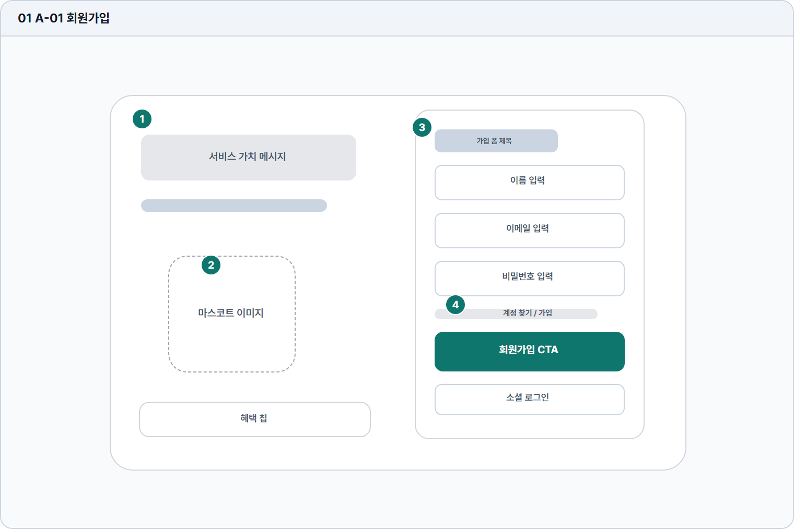

# 회원가입

- Source: 01 A-01 회원가입
- Code: A-01
- Wireframe: 

## Wireframe Number Map

| No. | Area | Description |
| --- | --- | --- |
| 1 | 브랜드 메시지 | TOPIK 쓰기 학습 가치와 AI 첨삭 효용을 첫 진입에 전달함. |
| 2 | 마스코트/혜택 영역 | 캐릭터와 혜택 칩으로 학습 서비스의 부담감을 낮춤. |
| 3 | 가입 입력 폼 | 이름, 이메일, 비밀번호 등 계정 생성 정보를 입력함. |
| 4 | 가입 CTA/소셜 로그인 | 가입 CTA와 소셜 로그인으로 온보딩 진입을 제공함. |

## Detailed Description
### 01 A-01 회원가입
1

■ 브랜드 메시지

▣ 설명

• TOPIK 쓰기 학습 가치와 AI 첨삭 효용을 첫 진입에 전달함.

▣ 제약 조건

• 제목 24자, 보조문 80자/2줄, 긴 번역은 실제 문구로 검수.

▣ 예외

• 다국어 확장으로 2줄 초과 시 문구를 축약함.

2

■ 마스코트/혜택 영역

▣ 설명

• 캐릭터와 혜택 칩으로 학습 서비스의 부담감을 낮춤.

▣ 제약 조건

• 혜택 칩은 3개 이하, 칩 라벨은 12자 이하로 작성.

▣ 예외

• 이미지 로드 실패 시 기본 캐릭터를 표시함.

3

■ 가입 입력 폼

▣ 설명

• 이름, 이메일, 비밀번호 등 계정 생성 정보를 입력함.

▣ 제약 조건

• 이름 2-30자, 이메일 80자 이하, PW 8-64자.

▣ 예외

• 중복 이메일/형식 오류는 필드 하단에 표시함.

4

■ 가입 CTA/소셜 로그인

▣ 설명

• 가입 CTA와 소셜 로그인으로 온보딩 진입을 제공함.

▣ 제약 조건

• 필수값 충족 전 비활성, 클릭 후 중복 CTA 차단.

▣ 예외

• 네트워크/인증 메일 실패, 소셜 취소 시 인라인 안내.

화면 목적 / 분기 / 피드백 / 예외 상황

목적

신규 사용자가 계정을 만들고 학습 시작 조건을 확보한다.

분기

이메일 가입, 소셜 로그인, 약관/혜택 확인 후 다음 단계로 이동.

피드백

입력 유효성, 중복 이메일, 비밀번호 강도, 가입 완료 토스트.

예외

예외: 네트워크/인증 메일 실패, 소셜 취소.
