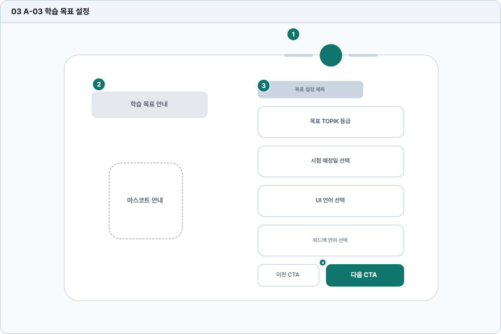

# 학습 목표 설정

- Source: 03 A-03 학습 목표 설정
- Code: A-03
- Wireframe: 

## Wireframe Number Map

| No. | Area | Description |
| --- | --- | --- |
| 1 | 온보딩 진행 단계 | 사용자가 현재 몇 번째 설정 단계에 있는지 알려주는 표시 영역. |
| 2 | 안내/마스코트 | 목표 설정이 맞춤 추천의 기반이라는 이유를 쉬운 문장으로 설명. |
| 3 | 목표 설정 항목 | 목표 급수, 시험 일정, 학습 빈도, 취약 영역을 입력함. |
| 4 | 이전/다음 CTA | 이전 단계 수정 또는 다음 단계 확정을 수행하는 액션 영역. |

## Detailed Description
### 03 A-03 학습 목표 설정
1

■ 온보딩 진행 단계

▣ 설명

• 사용자가 현재 몇 번째 설정 단계에 있는지 알려주는 표시 영역.

▣ 제약 조건: 단계명 12자 이하, 전체 단계 수와 현재 단계 항상 병기.

▣ 예외: 단계 정보 로드 실패 시 기본 1/3 진행률로 표시.

2

■ 안내/마스코트

▣ 설명

• 목표 설정이 맞춤 추천의 기반이라는 이유를 쉬운 문장으로 설명.

▣ 제약 조건: 안내문 80자/2줄, 다국어 확장 30% 허용.

▣ 예외: 긴 번역은 핵심 목적만 남기고 보조 설명 축약.

3

■ 목표 설정 항목

▣ 설명

• 목표 급수, 시험 일정, 학습 빈도, 취약 영역을 입력함.

▣ 제약 조건: 목표/시험일/언어 필수, 과거 날짜 선택 불가.

▣ 예외: 미지원 급수나 저장 실패는 항목 하단에 안내.

4

■ 이전/다음 CTA

▣ 설명

• 이전 단계 수정 또는 다음 단계 확정을 수행하는 액션 영역.

▣ 제약 조건: 필수값 누락 시 다음 CTA 비활성, 클릭 후 로딩 고정.

▣ 예외: 저장 실패 시 현재 화면 유지 후 재시도 토스트 표시.

화면 목적 / 분기 / 피드백 / 예외 상황

목적

초기 학습 수준과 목표를 저장해 추천 기준을 구성한다.

분기

목표 급수/시험일 설정, 건너뛰기, 다음 단계 이동.

피드백

필수값 누락, 날짜 형식, 저장 완료 상태를 안내.

예외

예외: 과거 날짜, 미지원 급수, 저장 실패.
