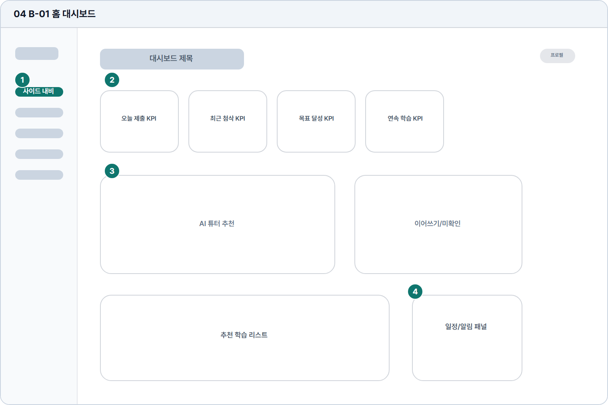

# 홈 대시보드

- Source: 04 B-01 홈 대시보드
- Code: B-01
- Wireframe: 

## Wireframe Number Map

| No. | Area | Description |
| --- | --- | --- |
| 1 | 학습자 사이드 내비 | 홈, 문제 풀기, 쓰기 연습, 내 서재, 성장 리포트, 설정을 고정. |
| 2 | KPI 요약 | 오늘 제출, 최근 첨삭, 목표 달성, 연속 학습을 요약함. |
| 3 | 추천/진행 카드 | 이어 풀 문제, 추천 유형, 최근 피드백을 카드로 제시함. |
| 4 | 일정/알림 보조 영역 | 시험 일정, 리마인더, 학습 알림을 우측 또는 하단에 배치. |

## Detailed Description
### 04 B-01 홈 대시보드
1

■ 학습자 사이드 내비

▣ 설명

• 홈, 문제 풀기, 쓰기 연습, 내 서재, 성장 리포트, 설정을 고정.

▣ 제약 조건: 메뉴명 10자 이하, 활성 메뉴 1개만 표시.

▣ 예외: 권한 잠금 메뉴는 비활성 스타일과 잠금 사유 표시.

2

■ KPI 요약

▣ 설명

• 오늘 제출, 최근 첨삭, 목표 달성, 연속 학습을 요약함.

▣ 제약 조건: KPI 4개 이하, 수치 라벨 1줄, 업데이트 시각 표시.

▣ 예외: 신규 사용자는 0값 대신 시작 유도 문구를 표시.

3

■ 추천/진행 카드

▣ 설명

• 이어 풀 문제, 추천 유형, 최근 피드백을 카드로 제시함.

▣ 제약 조건: 카드 제목 28자, 본문 2줄, 기본 3개/최대 5개.

▣ 예외: 추천 없음/최근 기록 없음은 빈 상태 카드로 대체.

4

■ 일정/알림 보조 영역

▣ 설명

• 시험 일정, 리마인더, 학습 알림을 우측 또는 하단에 배치.

▣ 제약 조건: 알림 항목 5개 이하, 날짜 표기는 로케일 기준 적용.

▣ 예외: 알림 로드 실패 시 재시도와 설정 이동 CTA 제공.

화면 목적 / 분기 / 피드백 / 예외 상황

목적

현재 학습 상태와 다음 행동을 요약해 홈 진입점을 만든다.

분기

추천 학습, 최근 첨삭, 목표 카드, 알림으로 이동.

피드백

카드 로딩, 신규 사용자 빈 상태, 진척률 반영.

예외

예외: 목표 없음, 추천 없음, 알림 로드 실패.
