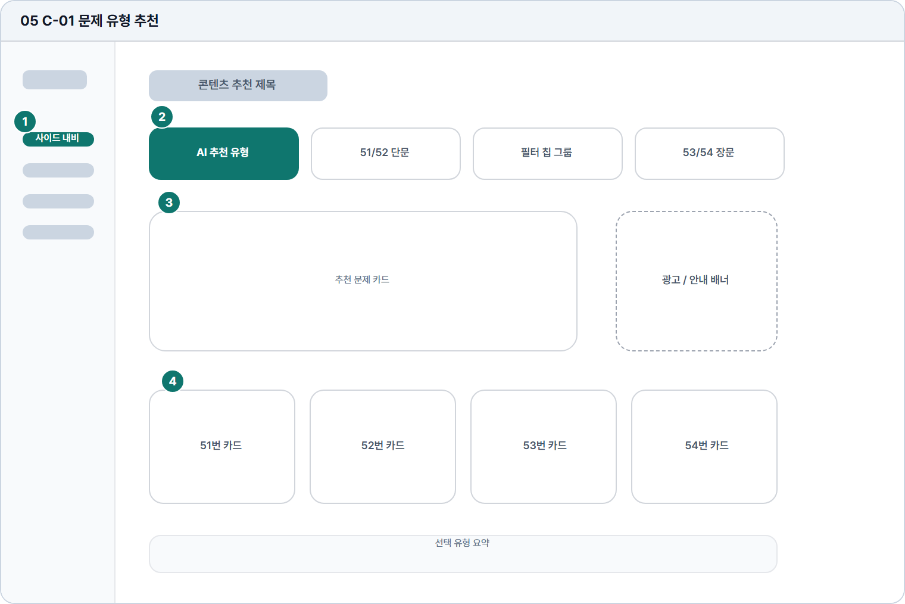

# 문제 유형 추천

- Source: 05 C-01 문제 유형 추천
- Code: C-01
- Wireframe: 

## Wireframe Number Map

| No. | Area | Description |
| --- | --- | --- |
| 1 | 학습자 사이드 내비 | 문제 추천 화면에서도 동일한 학습자 메뉴 구조를 유지함. |
| 2 | 유형 탭 | 51/52/53/54번 등 TOPIK 쓰기 유형을 필터링함. |
| 3 | 추천 문제 카드 | 사용자의 목표와 취약점에 맞는 우선 문제를 크게 제안함. |
| 4 | 유형별 선택 카드 | 추천 외에도 사용자가 직접 문제 유형을 선택하는 카드 목록. |

## Detailed Description
### 05 C-01 문제 유형 추천
1

■ 학습자 사이드 내비

▣ 설명

• 문제 추천 화면에서도 동일한 학습자 메뉴 구조를 유지함.

▣ 제약 조건: 선택 메뉴는 문제 풀기 1개만 활성, 터치 영역 44px 이상.

▣ 예외: 모바일에서는 햄버거 메뉴로 접고 현재 위치만 표시.

2

■ 유형 탭

▣ 설명

• 51/52/53/54번 등 TOPIK 쓰기 유형을 필터링함.

▣ 제약 조건: 탭 4개 고정, 탭 라벨 10자 이하, 가로 스크롤 허용.

▣ 예외: 권한 잠금 유형은 선택 불가와 잠금 배지를 표시.

3

■ 추천 문제 카드

▣ 설명

• 사용자의 목표와 취약점에 맞는 우선 문제를 크게 제안함.

▣ 제약 조건: 대표 추천 1개, 제목 32자, 추천 사유 2줄 이하.

▣ 예외: 추천 계산 실패 시 직접 선택 카드와 재시도 제공.

4

■ 유형별 선택 카드

▣ 설명

• 추천 외에도 사용자가 직접 문제 유형을 선택하는 카드 목록.

▣ 제약 조건: 카드 최대 4개, 카드 설명 60자 이하, 선택 상태 명확화.

▣ 예외: 이용 불가 유형은 비활성 카드와 안내 툴팁 표시.

화면 목적 / 분기 / 피드백 / 예외 상황

목적

사용자 상태 기반으로 풀 문제 유형을 추천한다.

분기

필터 변경, 카드 선택, 추천 유형 시작으로 이동.

피드백

선택 필터 강조, 추천 사유, 빈 결과 안내.

예외

예외: 추천 없음, 권한 잠금, 추천 계산 실패.
