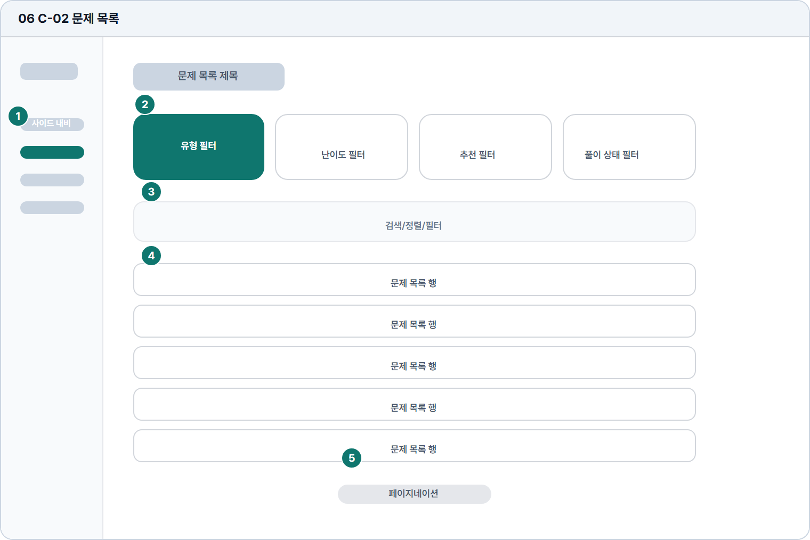

# 문제 목록

- Source: 06 C-02 문제 목록
- Code: C-02
- Wireframe: 

## Wireframe Number Map

| No. | Area | Description |
| --- | --- | --- |
| 1 | 학습자 사이드 내비 | 문제 목록 탐색 중에도 학습자 메뉴와 현재 위치를 유지함. |
| 2 | 문제 유형 필터 | 번호, 난이도, 추천 여부, 풀이 상태로 목록을 좁힘. |
| 3 | 검색/정렬 | 문제 제목, 키워드, 주제어로 검색하고 최신순 등으로 정렬. |
| 4 | 문제 목록 행 | 문제 번호, 유형, 난이도, 상태, 시작 액션을 행 단위로 표시. |
| 5 | 페이지 이동 | 목록이 길어질 때 페이지 번호 또는 이전/다음으로 탐색함. |

## Detailed Description
### 06 C-02 문제 목록
1

■ 학습자 사이드 내비

▣ 설명

• 문제 목록 탐색 중에도 학습자 메뉴와 현재 위치를 유지함.

▣ 제약 조건: 현재 메뉴 1개 활성, 메뉴 접힘 상태에서도 아이콘 유지.

▣ 예외: 권한 제한 메뉴는 잠금 상태와 업그레이드 안내 표시.

2

■ 문제 유형 필터

▣ 설명

• 번호, 난이도, 추천 여부, 풀이 상태로 목록을 좁힘.

▣ 제약 조건: 필터 동시 사용 가능, 선택 칩 5개 이하 표시.

▣ 예외: 조합 결과 없음은 빈 결과 화면과 초기화 CTA 제공.

3

■ 검색/정렬

▣ 설명

• 문제 제목, 키워드, 주제어로 검색하고 최신순 등으로 정렬.

▣ 제약 조건: 검색어 2-40자, 정렬 1개 선택, debounce 300ms.

▣ 예외: 검색 실패/금칙어 입력은 검색창 하단에 안내.

4

■ 문제 목록 행

▣ 설명

• 문제 번호, 유형, 난이도, 상태, 시작 액션을 행 단위로 표시.

▣ 제약 조건: 10개/페이지, 행 제목 32자, 상태 배지 1개 우선.

▣ 예외: 비공개/만료 문제는 행 비활성 및 사유 표시.

5

■ 페이지 이동

▣ 설명

• 목록이 길어질 때 페이지 번호 또는 이전/다음으로 탐색함.

▣ 제약 조건: 페이지 버튼 5개, 총 건수는 목록 상단/하단에 표시.

▣ 예외: 첫/마지막 페이지에서는 이전/다음 버튼 비활성.

화면 목적 / 분기 / 피드백 / 예외 상황

목적

문제를 탐색하고 조건별로 선택할 수 있게 한다.

분기

유형 필터, 정렬/검색, 상세 보기, 페이지 이동.

피드백

선택 필터, 결과 수, 페이지 상태를 명확히 표시.

예외

예외: 결과 없음, 로딩 실패, 비공개 문제.
