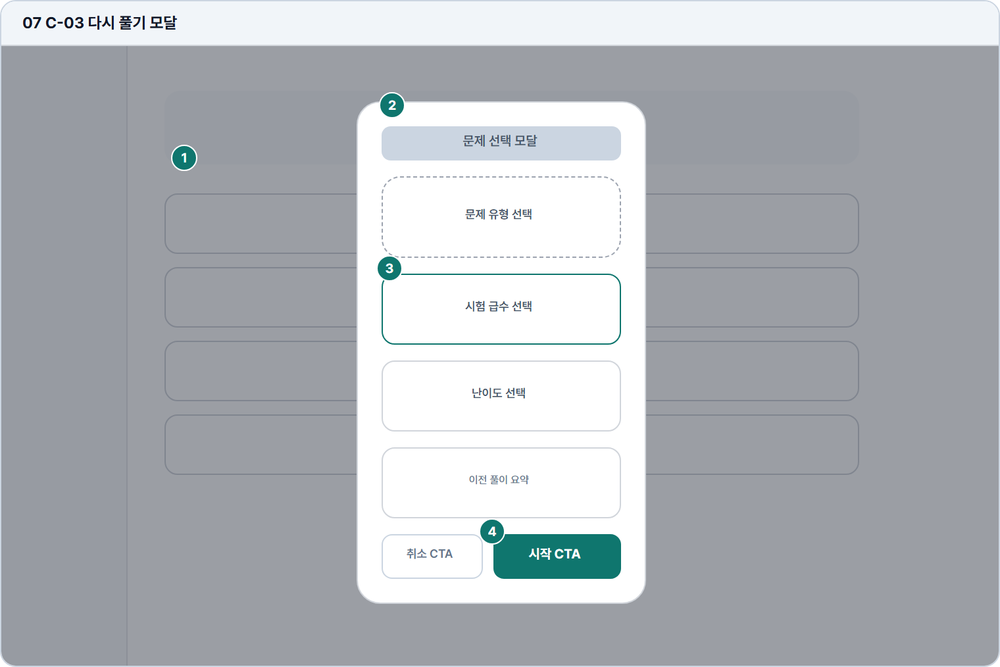

# 다시 풀기 모달

- Source: 07 C-03 다시 풀기 모달
- Code: C-03
- Wireframe: 

## Wireframe Number Map

| No. | Area | Description |
| --- | --- | --- |
| 1 | 배경 문제 목록 | 문제 목록에서 특정 문제를 선택한 뒤 모달이 열린 상태. |
| 2 | 모달 제목/문제 요약 | 선택한 문제의 제목, 유형, 이전 풀이 상태를 재확인시킴. |
| 3 | 재풀이 모드 선택 | 새 답안, 이전 답안 기반, 힌트 포함 등 풀이 모드를 선택함. |
| 4 | 취소/시작 CTA | 취소는 목록 복귀, 시작은 선택 모드로 풀이 화면을 엶. |

## Detailed Description
### 07 C-03 재풀이 모드 모달
1

■ 배경 문제 목록

▣ 설명

• 문제 목록에서 특정 문제를 선택한 뒤 모달이 열린 상태.

▣ 제약 조건: 배경은 dim 처리, 스크롤 잠금, 포커스는 모달 내부 고정.

▣ 예외: 배경 클릭 닫기는 위험 상태에서는 비활성.

2

■ 모달 제목/문제 요약

▣ 설명

• 선택한 문제의 제목, 유형, 이전 풀이 상태를 재확인시킴.

▣ 제약 조건: 제목 28자, 요약 3항목 이하, 긴 제목 말줄임.

▣ 예외: 문제 만료 시 시작 대신 만료 안내와 닫기만 제공.

3

■ 재풀이 모드 선택

▣ 설명

• 새 답안, 이전 답안 기반, 힌트 포함 등 풀이 모드를 선택함.

▣ 제약 조건: 모드 3개 이하, 하나는 기본 선택, 선택 전 시작 비활성.

▣ 예외: 선택값 없음 또는 권한 없음은 옵션 하단에 안내.

4

■ 취소/시작 CTA

▣ 설명

• 취소는 목록 복귀, 시작은 선택 모드로 풀이 화면을 엶.

▣ 제약 조건: CTA 2개 고정, 시작 클릭 후 중복 실행 차단.

▣ 예외: 시작 실패 시 모달 유지, 오류와 재시도 버튼 표시.

화면 목적 / 분기 / 피드백 / 예외 상황

목적

재풀이 시작 전 조건을 확인하고 학습을 시작한다.

분기

유형/급수/난이도 선택 후 시작 또는 취소.

피드백

선택값 강조, 시작 가능 조건, 로딩 상태 표시.

예외

예외: 문제 만료, 선택값 없음, 시작 실패.
