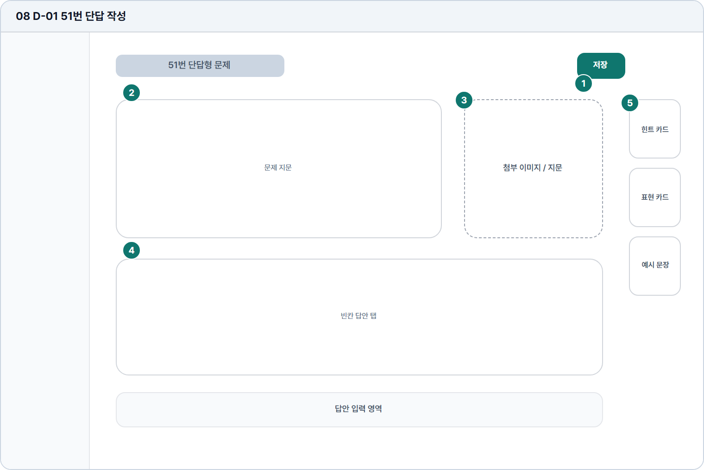

# 51번 단답 작성

- Source: 08 D-01 51번 단답 작성
- Code: D-01
- Wireframe: 

## Wireframe Number Map

| No. | Area | Description |
| --- | --- | --- |
| 1 | 저장/제출 액션 | 작성 중 답안을 저장하거나 제출하는 상단/우측 액션 영역. |
| 2 | 문제 지문 | 51번 유형의 지문, 빈칸 조건, 답안 작성 규칙을 읽는 영역. |
| 3 | 참고 이미지 | 표, 이미지, 보기 자료가 있을 때 표시되는 보조 자료 영역. |
| 4 | 답안 입력 | 짧은 문장 또는 단답형 답안을 작성하는 입력 필드 영역. |
| 5 | 우측 도움말 | 유형별 작성 팁, 틀리기 쉬운 표현, 예시 문장을 제공함. |

## Detailed Description
### 08 D-01 51번 단답 작성
1

■ 저장/제출 액션

▣ 설명

• 작성 중 답안을 저장하거나 제출하는 상단/우측 액션 영역.

▣ 제약 조건: 자동저장 상태 표시, 제출 전 확인 모달 필수.

▣ 예외: 저장 실패/네트워크 오류 시 상태 배지와 재시도 표시.

2

■ 문제 지문

▣ 설명

• 51번 유형의 지문, 빈칸 조건, 답안 작성 규칙을 읽는 영역.

▣ 제약 조건: 지문 3줄 우선, 긴 문항은 접기 없이 영역 확장.

▣ 예외: 지문 로드 실패 시 재시도와 문제 목록 복귀 제공.

3

■ 참고 이미지

▣ 설명

• 표, 이미지, 보기 자료가 있을 때 표시되는 보조 자료 영역.

▣ 제약 조건: 이미지 비율 유지, 캡션 40자 이하, 확대 보기 지원.

▣ 예외: 이미지 없음/로드 실패 시 대체 텍스트와 빈 프레임 표시.

4

■ 답안 입력

▣ 설명

• 짧은 문장 또는 단답형 답안을 작성하는 입력 필드 영역.

▣ 제약 조건: 답안 10-120자, blur와 제출 시 검증, 글자수 표시.

▣ 예외: 글자수 미달/초과는 입력창 하단에 즉시 표시.

5

■ 우측 도움말

▣ 설명

• 유형별 작성 팁, 틀리기 쉬운 표현, 예시 문장을 제공함.

▣ 제약 조건: 카드 3개 이하, 카드 제목 16자, 본문 2줄 제한.

▣ 예외: 도움말 없음은 접힌 빈 상태와 추천 링크 제공.

화면 목적 / 분기 / 피드백 / 예외 상황

목적

단답 문제를 읽고 답안을 저장/제출한다.

분기

저장, 도구 사용, 첨부 이미지 확인, 답안 작성.

피드백

자동저장, 글자 수, 저장 완료 상태를 표시.

예외

예외: 글자수 미달/초과, 저장 실패, 네트워크 오류.
