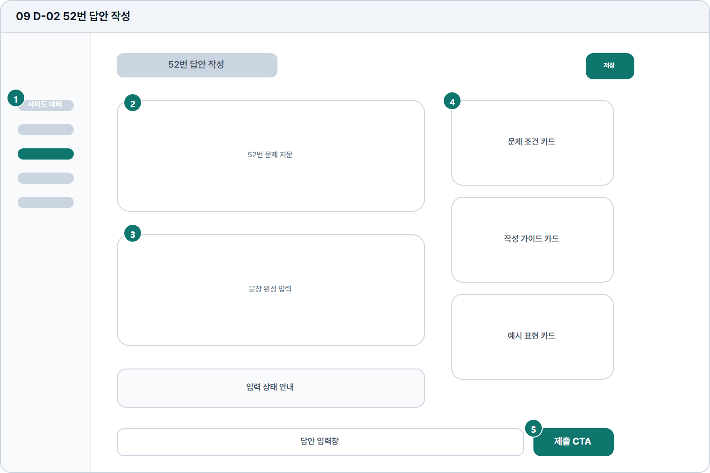

# 52번 답안 작성

- Source: 09 D-02 52번 답안 작성
- Code: D-02
- Wireframe: 

## Wireframe Number Map

| No. | Area | Description |
| --- | --- | --- |
| 1 | 학습자 사이드 내비 | 답안 작성 중에도 주요 학습 메뉴와 현재 위치를 유지함. |
| 2 | 문제/조건 영역 | 52번 지문, 조건, 작성 기준을 한눈에 확인하는 영역. |
| 3 | 답안 입력 | 52번 문장형 단답을 작성하는 중심 입력 영역. |
| 4 | 우측 작성 도움말 | 문장 구조, 연결어, 표현 등 52번 유형 도움말을 제공함. |
| 5 | 저장/제출 CTA | 임시 저장과 최종 제출을 분리해 오제출을 방지함. |

## Detailed Description
### 09 D-02 52번 답안 작성
1

■ 학습자 사이드 내비

▣ 설명

• 답안 작성 중에도 주요 학습 메뉴와 현재 위치를 유지함.

▣ 제약 조건: 메뉴명 10자 이하, 작성 화면에서는 이탈 경고 조건 적용.

▣ 예외: 저장 전 이동 시 자동저장 경고 모달을 띄움.

2

■ 문제/조건 영역

▣ 설명

• 52번 지문, 조건, 작성 기준을 한눈에 확인하는 영역.

▣ 제약 조건: 지문 3줄, 조건 4개 이하, 핵심 조건은 항상 노출.

▣ 예외: 조건 누락/로드 실패 시 제출 CTA 비활성 및 재시도 표시.

3

■ 답안 입력

▣ 설명

• 52번 문장형 단답을 작성하는 중심 입력 영역.

▣ 제약 조건: 답안 10-160자, 글자수 실시간 표시, blur+제출 검증.

▣ 예외: 시간/글자수 초과는 입력창 하단에 즉시 표시.

4

■ 우측 작성 도움말

▣ 설명

• 문장 구조, 연결어, 표현 등 52번 유형 도움말을 제공함.

▣ 제약 조건: 도움말 카드 3개 이하, 카드 본문 2줄 제한.

▣ 예외: 도움말 로드 실패 시 접힌 상태와 재시도 링크 표시.

5

■ 저장/제출 CTA

▣ 설명

• 임시 저장과 최종 제출을 분리해 오제출을 방지함.

▣ 제약 조건: 저장/제출 CTA 분리, 제출 클릭 후 중복 제출 차단.

▣ 예외: 네트워크 오류/저장 실패 시 현재 작성 내용을 유지.

화면 목적 / 분기 / 피드백 / 예외 상황

목적

조건 카드와 가이드를 참고해 단문 답안을 작성한다.

분기

조건 확인, 가이드 열람, 임시저장, 제출.

피드백

입력 상태, 조건 충족 여부, 제출 완료 안내.

예외

예외: 시간/글자수 초과, 네트워크 오류.
