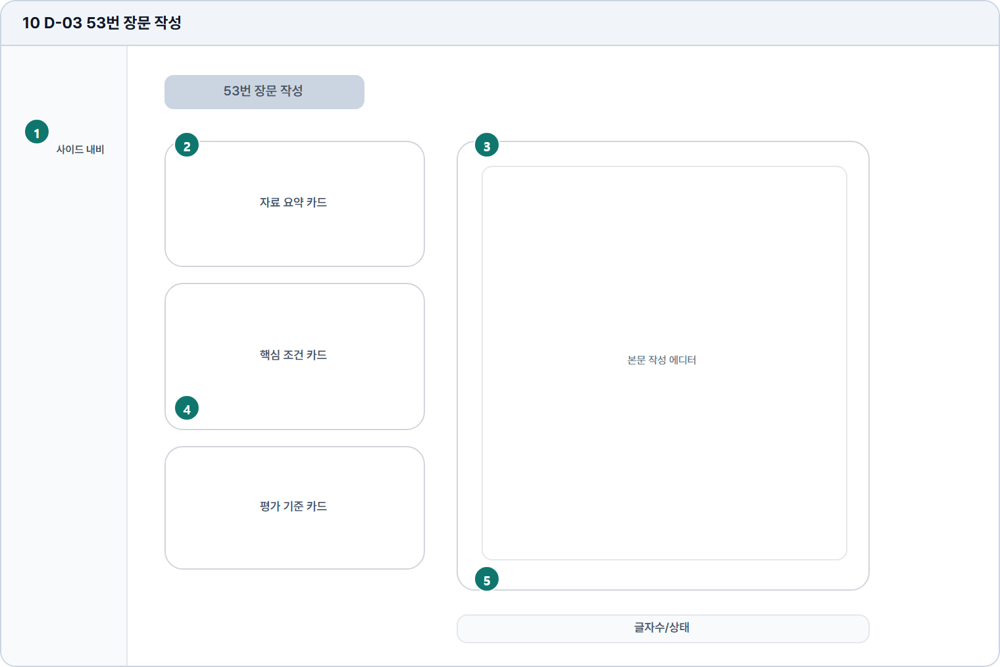

# 53번 장문 작성

- Source: 10 D-03 53번 장문 작성
- Code: D-03
- Wireframe: 

## Wireframe Number Map

| No. | Area | Description |
| --- | --- | --- |
| 1 | 학습자 사이드 내비 | 53번 장문 작성 중에도 앱 기본 이동 구조를 유지함. |
| 2 | 문제/자료 패널 | 53번 지문, 그래프, 조건, 참고 자료를 좌측에 배치함. |
| 3 | 본문 작성 에디터 | 장문 답안을 원고지 형식으로 작성하는 핵심 입력 영역. |
| 4 | 평가 기준 카드 | 조건 충족 여부, 평가 기준, 자료 반영 상태를 보조 지표로 제공. |
| 5 | 글자수/상태 | 목표 글자 수, 현재 작성량, 자동저장, 제출 가능 여부를 표시. |

## Detailed Description
### 10 D-03 53번 장문 작성
1

■ 학습자 사이드 내비

▣ 설명

• 53번 장문 작성 중에도 앱 기본 이동 구조를 유지함.

▣ 제약 조건: 작성 중 이탈은 자동저장 상태 확인 후 허용.

▣ 예외: 저장 실패 상태에서는 이탈 확인 모달을 강제 표시.

2

■ 문제/자료 패널

▣ 설명

• 53번 지문, 그래프, 조건, 참고 자료를 좌측에 배치함.

▣ 제약 조건: 자료 카드 3개 이하, 제목 24자, 긴 자료는 내부 스크롤.

▣ 예외: 자료 누락/이미지 실패 시 대체 텍스트와 재시도 표시.

3

■ 본문 작성 에디터

▣ 설명

• 장문 답안을 원고지 형식으로 작성하는 핵심 입력 영역.

▣ 제약 조건: 200-300자 권장, 최소 120자, 문단 수 표시.

▣ 예외: 글자수 부족/초과는 제출 전 모달과 필드 하단에 표시.

4

■ 평가 기준 카드

▣ 설명

• 조건 충족 여부, 평가 기준, 자료 반영 상태를 보조 지표로 제공.

▣ 제약 조건: 기준 항목 5개 이하, 충족/주의/미충족 상태로 표시.

▣ 예외: 기준 계산 실패 시 수동 체크 안내로 대체.

5

■ 글자수/상태

▣ 설명

• 목표 글자 수, 현재 작성량, 자동저장, 제출 가능 여부를 표시.

▣ 제약 조건: 상태 문구 20자 이하, 자동저장 시각은 상대 시간 표시.

▣ 예외: 자동저장 실패 시 경고 색상과 재시도 액션 표시.

화면 목적 / 분기 / 피드백 / 예외 상황

목적

자료 요약과 기준을 바탕으로 장문 답안을 작성한다.

분기

자료 카드 전환, 본문 편집, 저장/제출.

피드백

문단/분량, 자동저장, 기준 충족 안내.

예외

예외: 글자수 부족, 자료 누락, 자동저장 실패.
