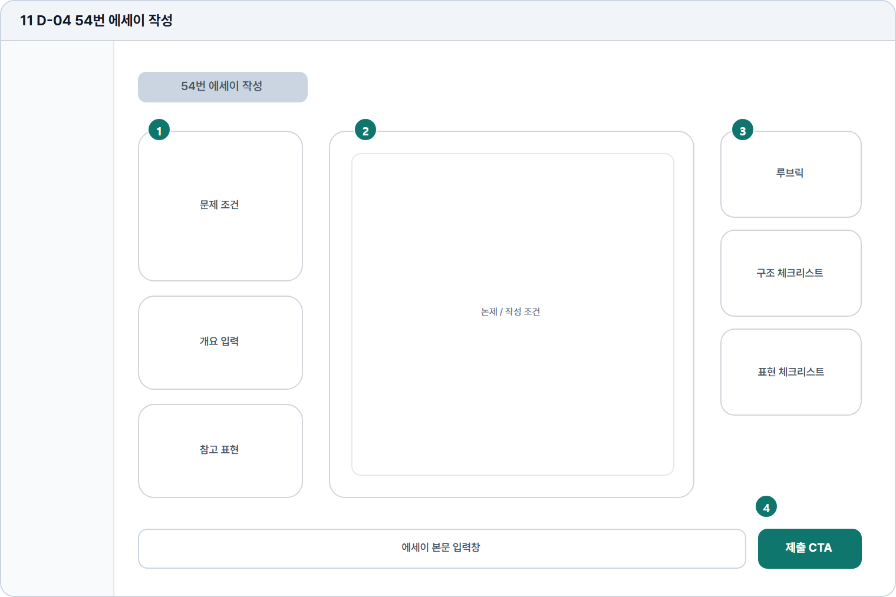

# 54번 에세이 작성

- Source: 11 D-04 54번 에세이 작성
- Code: D-04
- Wireframe: 

## Wireframe Number Map

| No. | Area | Description |
| --- | --- | --- |
| 1 | 문제/조건 패널 | 54번 주제, 조건, 평가 기준을 좌측에 고정 표시함. |
| 2 | 에세이 작성 원고지 | 긴 글을 문단 단위로 구성하는 주 입력 영역. |
| 3 | 우측 체크리스트 | 서론/본론/결론, 근거, 연결 표현 체크 항목을 제공함. |
| 4 | 저장/제출 CTA | 자동저장, 수동저장, 최종 제출을 관리하는 액션 영역. |

## Detailed Description
### 11 D-04 54번 에세이 작성
1

■ 문제/조건 패널

▣ 설명

• 54번 주제, 조건, 평가 기준을 좌측에 고정 표시함.

▣ 제약 조건: 조건 5개 이하, 주제문 2줄, 루브릭 요약 3항목.

▣ 예외: 조건 로드 실패 시 본문 작성과 제출을 잠금 처리.

2

■ 에세이 작성 원고지

▣ 설명

• 긴 글을 문단 단위로 구성하는 주 입력 영역.

▣ 제약 조건: 600-700자 권장, 최소 300자, 문단 구분 표시.

▣ 예외: 분량 부족/저장 실패/이탈은 경고 모달로 안내.

3

■ 우측 체크리스트

▣ 설명

• 서론/본론/결론, 근거, 연결 표현 체크 항목을 제공함.

▣ 제약 조건: 체크 항목 6개 이하, 상태는 완료/주의/미확인으로 표시.

▣ 예외: 항목 계산 실패 시 수동 확인 안내로 대체.

4

■ 저장/제출 CTA

▣ 설명

• 자동저장, 수동저장, 최종 제출을 관리하는 액션 영역.

▣ 제약 조건: 위험 CTA는 확인 모달 필수, 제출 후 수정 불가 안내.

▣ 예외: 제출 실패 시 답안 보존, 재시도와 문의 링크 제공.

화면 목적 / 분기 / 피드백 / 예외 상황

목적

개요와 루브릭을 참고해 에세이 답안을 작성한다.

분기

문제 조건, 개요, 참고 표현, 루브릭 확인 후 제출.

피드백

구조 체크, 분량 체크, 제출 진행 상태 표시.

예외

예외: 이탈, 저장 실패, 제출 후 수정 불가.
