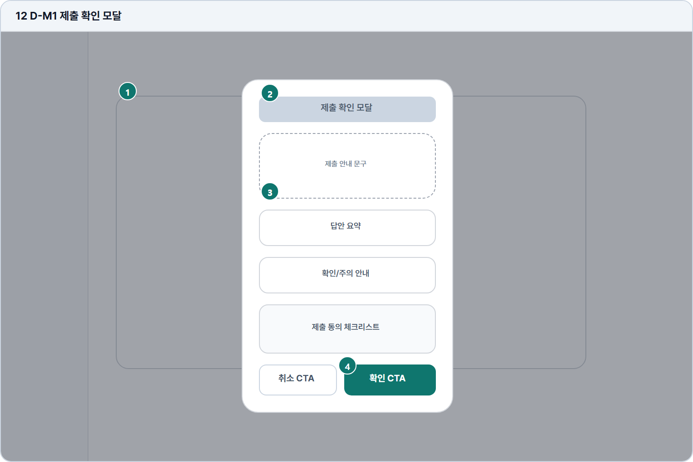

# 제출 확인 모달

- Source: 12 D-M1 제출 확인 모달
- Code: D-M1
- Wireframe: 

## Wireframe Number Map

| No. | Area | Description |
| --- | --- | --- |
| 1 | 배경 답안 화면 | 제출 버튼 직후 배경 화면을 비활성 상태로 유지함. |
| 2 | 제출 요약 | 문제 유형, 답안 길이, 저장 시각, 제출 대상을 요약함. |
| 3 | 확인 정보/주의 | 제출 후 AI 분석 시작과 대기 가능성을 안내함. |
| 4 | 취소/제출 CTA | 취소는 작성 화면 복귀, 제출은 AI 분석 로딩으로 이동함. |

## Detailed Description
### 12 D-M1 제출 확인 모달
1

■ 배경 답안 화면

▣ 설명

• 제출 버튼 직후 배경 화면을 비활성 상태로 유지함.

▣ 제약 조건: 배경 dim 처리, 스크롤 잠금, 모달 외 포커스 차단.

▣ 예외: 모달 닫기 시 작성 화면 상태와 입력값을 그대로 복구.

2

■ 제출 요약

▣ 설명

• 문제 유형, 답안 길이, 저장 시각, 제출 대상을 요약함.

▣ 제약 조건: 요약 3항목, 각 항목 24자 이하, 긴 답안은 글자수만 표시.

▣ 예외: 요약 생성 실패 시 문제유형/글자수 최소 정보만 표시.

3

■ 확인 정보/주의

▣ 설명

• 제출 후 AI 분석 시작과 대기 가능성을 안내함.

▣ 제약 조건: 주의 문구 80자/2줄, 동의 체크. 체크 사항 리마인더.

▣ 예외: 분석 시작 실패 가능성은 재시도 안내와 함께 표시.

4

■ 취소/제출 CTA

▣ 설명

• 취소는 작성 화면 복귀, 제출은 AI 분석 로딩으로 이동함.

▣ 제약 조건: CTA 2개 동일 폭, 제출 클릭 후 중복 제출 차단.

▣ 예외: 제출 실패 시 모달 유지, 오류 원인과 재시도 표시.

화면 목적 / 분기 / 피드백 / 예외 상황

목적

제출 전 답안 요약과 동의 상태를 확인한다.

분기

확인 CTA, 취소, 요약 재확인으로 이동.

피드백

제출 중 로딩, 동의 체크 활성화, 완료 안내.

예외

예외: 제출 실패, 분석 시작 실패, 중복 제출.
