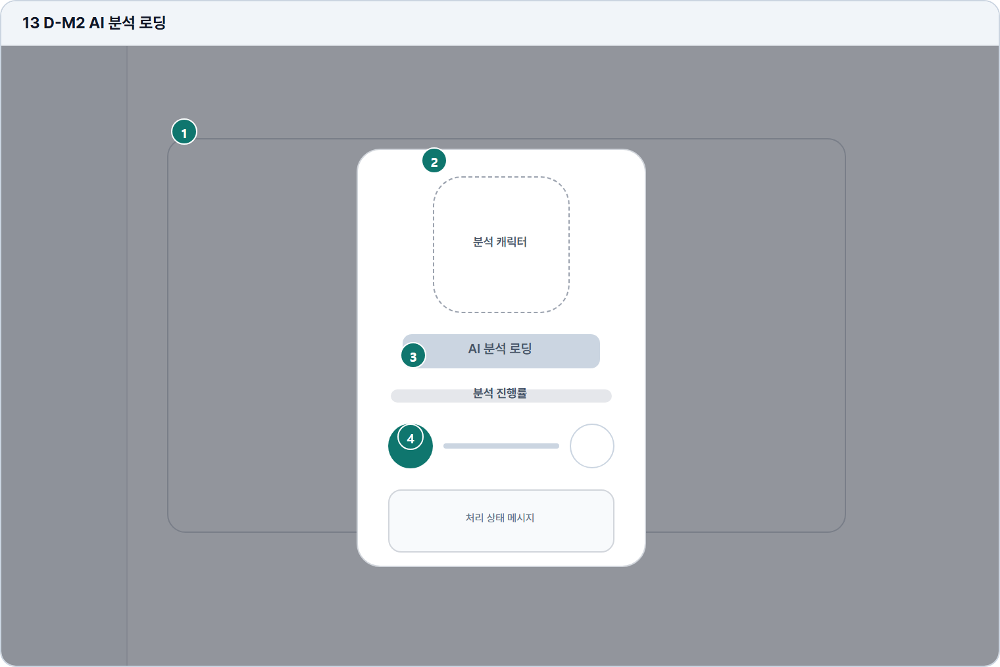

# AI 분석 로딩

- Source: 13 D-M2 AI 분석 로딩
- Code: D-M2
- Wireframe: 

## Wireframe Number Map

| No. | Area | Description |
| --- | --- | --- |
| 1 | 배경 답안 화면 | 제출된 답안 화면을 배경으로 유지해 분석 맥락을 보존함. |
| 2 | AI 분석 캐릭터 | 분석 진행 중임을 정서적으로 보여주는 중심 시각 요소. |
| 3 | 분석 진행 단계 | 문법, 구성, 표현, 점수 산출 단계를 순차적으로 표시함. |
| 4 | 상태/안내 메시지 | 예상 대기 시간, 유의사항, 완료 후 이동 화면을 안내함. |

## Detailed Description
### 13 D-M2 AI 분석 로딩
1

■ 배경 답안 화면

▣ 설명

• 제출된 답안 화면을 배경으로 유지해 분석 맥락을 보존함.

▣ 제약 조건: 배경은 읽기 전용, 입력/CTA 비활성, dim 상태 유지.

▣ 예외: 뒤로가기 시 분석 중단 경고를 표시.

2

■ AI 분석 캐릭터

▣ 설명

• 분석 진행 중임을 정서적으로 보여주는 중심 시각 요소.

▣ 제약 조건: 애니메이션은 1개 핵심 루프, 텍스트를 가리지 않음.

▣ 예외: 모션 비활성 설정 시 정적 이미지로 대체.

3

■ 분석 진행 단계

▣ 설명

• 문법, 구성, 표현, 점수 산출 단계를 순차적으로 표시함.

▣ 제약 조건: 단계 4개 이하, 현재 단계만 강조, 예상 시간 범위 표시.

▣ 예외: 분석 지연 시 지연 안내와 재시도 가능 시점 표시.

4

■ 상태/안내 메시지

▣ 설명

• 예상 대기 시간, 유의사항, 완료 후 이동 화면을 안내함.

▣ 제약 조건: 메시지 60자 이하, 2줄 제한, 10초 이상 지연 시 갱신.

▣ 예외: 재시도 오류/분석 실패는 오류 상태와 고객지원 링크 표시.

화면 목적 / 분기 / 피드백 / 예외 상황

목적

제출 후 AI 분석 진행 상태를 제공한다.

분기

분석 완료 후 피드백 이동, 대기 유지.

피드백

진행률, 단계 메시지, 예상 대기 시간을 표시.

예외

예외: 분석 지연, 재시도 오류, 뒤로가기.
