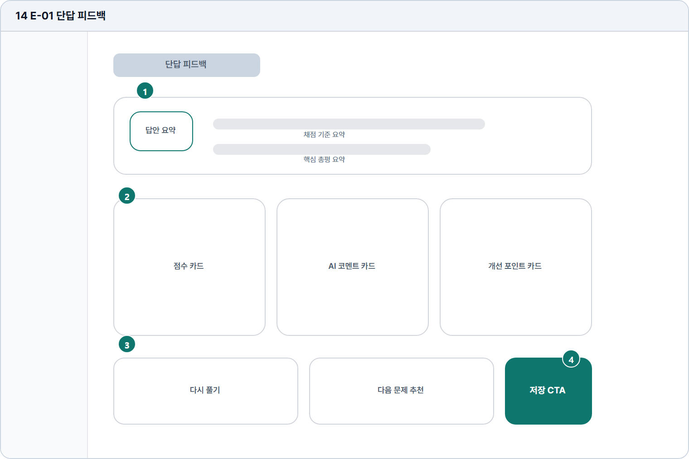

# 단답 피드백

- Source: 14 E-01 단답 피드백
- Code: E-01
- Wireframe: 

## Wireframe Number Map

| No. | Area | Description |
| --- | --- | --- |
| 1 | 점수/총평 요약 | AI 분석 점수, 평가 요약, 핵심 개선 포인트를 상단에 제시함. |
| 2 | 항목별 피드백 카드 | 문법, 어휘, 내용, 표현 등 평가 항목별 결과를 카드로 표시. |
| 3 | 추천 학습 카드 | 답안 약점을 바탕으로 복습 콘텐츠나 유사 문제를 추천함. |
| 4 | 다음 행동 CTA | 다시 풀기, 다음 문제, 저장, 비교 리포트 등 후속 행동 제공. |

## Detailed Description
### 14 E-01 단답 피드백
1

■ 점수/총평 요약

▣ 설명

• AI 분석 점수, 평가 요약, 핵심 개선 포인트를 상단에 제시함.

▣ 제약 조건: 총평 3줄 이하, 점수는 한 화면 첫 영역에 우선 노출.

▣ 예외: 부분 피드백이면 가능한 항목만 표시하고 누락 사유 제공.

2

■ 항목별 피드백 카드

▣ 설명

• 문법, 어휘, 내용, 표현 등 평가 항목별 결과를 카드로 표시.

▣ 제약 조건: 카드 4개 이하, 카드 제목 14자, 본문 2줄 제한.

▣ 예외: 분석 실패 항목은 회색 카드와 재분석 안내 표시.

3

■ 추천 학습 카드

▣ 설명

• 답안 약점을 바탕으로 복습 콘텐츠나 유사 문제를 추천함.

▣ 제약 조건: 추천 3개 이하, 제목 28자, 추천 사유 1줄.

▣ 예외: 다음 문제 없음은 직접 문제 목록 CTA로 대체.

4

■ 다음 행동 CTA

▣ 설명

• 다시 풀기, 다음 문제, 저장, 비교 리포트 등 후속 행동 제공.

▣ 제약 조건: 주요 CTA 1개, 보조 CTA 3개 이하, 중복 클릭 차단.

▣ 예외: 저장 실패/권한 잠금은 해당 CTA 옆에 상태 표시.

화면 목적 / 분기 / 피드백 / 예외 상황

목적

단답 결과와 개선 포인트를 제공한다.

분기

다시 풀기, 다음 문제 추천, 결과 저장.

피드백

점수, 코멘트, 개선 카드 상태를 반영한다.

예외

예외: 부분 피드백, 분석 실패, 다음 문제 없음.
