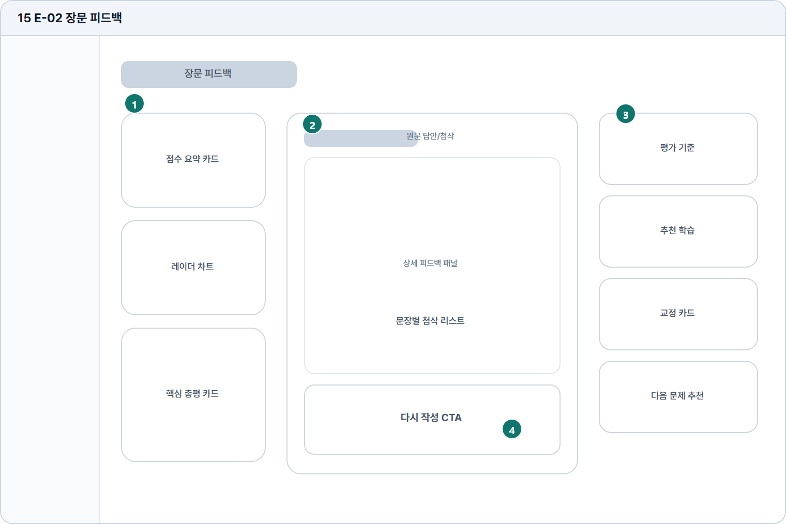

# 장문 피드백

- Source: 15 E-02 장문 피드백
- Code: E-02
- Wireframe: 

## Wireframe Number Map

| No. | Area | Description |
| --- | --- | --- |
| 1 | 문제/점수 요약 | 장문 답안의 총점, 유형, 제출 정보, 핵심 총평을 요약함. |
| 2 | 원문 답안/첨삭 | 원문 답안과 문장 단위 첨삭, 수정 제안을 함께 제공함. |
| 3 | 상세 피드백 패널 | 구조, 논리, 어휘, 문법, 주제 적합성을 세부 평가함. |
| 4 | 하단 액션 | 다시 작성, PDF 저장, 비교 리포트, 다음 문제 추천 액션 제공. |

## Detailed Description
### 15 E-02 장문 피드백
1

■ 문제/점수 요약

▣ 설명

• 장문 답안의 총점, 유형, 제출 정보, 핵심 총평을 요약함.

▣ 제약 조건: 상단 요약 4항목 이하, 총평 3줄, 긴 문장 말줄임.

▣ 예외: 점수 산출 실패 시 총평 대신 분석 실패 안내 표시.

2

■ 원문 답안/첨삭

▣ 설명

• 원문 답안과 문장 단위 첨삭, 수정 제안을 함께 제공함.

▣ 제약 조건: 문장별 첨삭 5개 후 더보기, 원문은 줄바꿈 보존.

▣ 예외: 첨삭 생성 실패 문장은 원문만 표시하고 재분석 제공.

3

■ 상세 피드백 패널

▣ 설명

• 구조, 논리, 어휘, 문법, 주제 적합성을 세부 평가함.

▣ 제약 조건: 평가 항목 5개 이하, 각 항목 본문 2줄 우선.

▣ 예외: 추천 없음/항목 누락은 빈 상태와 보완 안내 표시.

4

■ 하단 액션

▣ 설명

• 다시 작성, PDF 저장, 비교 리포트, 다음 문제 추천 액션 제공.

▣ 제약 조건: CTA 4개 이하, 모바일은 탭/스택 전환.

▣ 예외: PDF 실패/권한 잠금은 토스트와 대체 저장 안내 표시.

화면 목적 / 분기 / 피드백 / 예외 상황

목적

장문 답안의 문장별 첨삭과 학습 추천을 제공한다.

분기

문장 선택, 평가 기준 확인, 다시 작성.

피드백

문장별 상태, 추천 학습, 재작성 CTA를 표시.

예외

예외: 첨삭 생성 실패, PDF 실패, 추천 없음.
