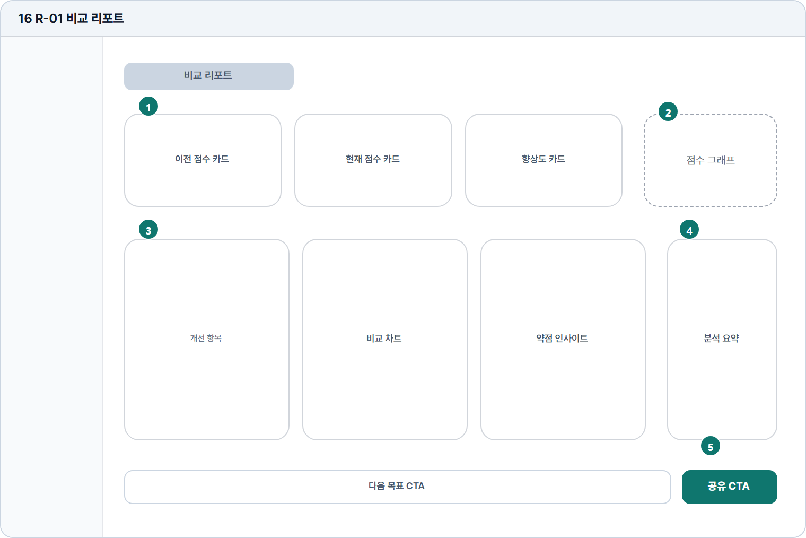

# 비교 리포트

- Source: 16 R-01 비교 리포트
- Code: R-01
- Wireframe: 

## Wireframe Number Map

| No. | Area | Description |
| --- | --- | --- |
| 1 | 비교 KPI | 이전/현재 답안의 점수, 개선 폭, 항목별 변화를 요약함. |
| 2 | 점수 그래프 | 점수 변화와 항목별 강약을 시각화해 성장 흐름을 보여줌. |
| 3 | 항목별 비교 카드 | 문법, 어휘, 구성, 내용 충실도 등 전후 변화를 비교함. |
| 4 | 분석 요약 | AI가 두 답안의 차이와 개선 원인을 문장 단위로 설명함. |
| 5 | 다음 CTA | 다시 풀기, 약점 추천, 다음 문제 등 후속 학습 경로를 제시함. |

## Detailed Description
### 16 R-01 비교 리포트
1

■ 비교 KPI

▣ 설명

• 이전/현재 답안의 점수, 개선 폭, 항목별 변화를 요약함.

▣ 제약 조건: 비교 대상 2개 기본/5개 최대, KPI 라벨 1줄.

▣ 예외: 비교 데이터 부족 시 단일 결과 요약으로 대체.

2

■ 점수 그래프

▣ 설명

• 점수 변화와 항목별 강약을 시각화해 성장 흐름을 보여줌.

▣ 제약 조건: 범례 5개 이하, 모바일은 가로 스크롤 또는 요약 차트.

▣ 예외: 차트 로드 실패 시 표 형태 대체와 재시도 제공.

3

■ 항목별 비교 카드

▣ 설명

• 문법, 어휘, 구성, 내용 충실도 등 전후 변화를 비교함.

▣ 제약 조건: 카드 4개 이하, 변화값은 상승/하락/유지로 표시.

▣ 예외: 이전 데이터 없음은 현재 점수 카드만 표시.

4

■ 분석 요약

▣ 설명

• AI가 두 답안의 차이와 개선 원인을 문장 단위로 설명함.

▣ 제약 조건: 요약 3줄 이하, 실제 비교 문구 기준으로 검수.

▣ 예외: 분석 생성 실패 시 핵심 지표만 남기고 재시도 제공.

5

■ 다음 CTA

▣ 설명

• 다시 풀기, 약점 추천, 다음 문제 등 후속 학습 경로를 제시함.

▣ 제약 조건: CTA 3개 이하, 대표 CTA 1개, 중복 클릭 차단.

▣ 예외: 추천 없음/권한 잠금은 비활성 CTA와 사유 표시.

화면 목적 / 분기 / 피드백 / 예외 상황

목적

이전/현재 성과와 약점 변화를 비교한다.

분기

공유, 차트 확인, 약점 인사이트로 이동.

피드백

향상도 카드, 비교 차트, 공유 완료 상태.

예외

예외: 비교 데이터 부족, 차트 로드 실패.
