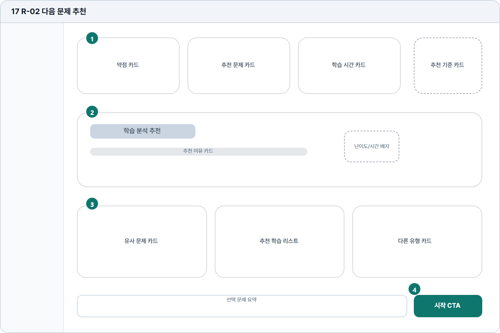

# 다음 문제 추천

- Source: 17 R-02 다음 문제 추천
- Code: R-02
- Wireframe: 

## Wireframe Number Map

| No. | Area | Description |
| --- | --- | --- |
| 1 | 성과 요약 카드 | 완료 문제의 약점, 다음 추천 유형, 예상 학습 시간을 요약함. |
| 2 | 추천 문제 하이라이트 | AI가 다음에 풀면 좋은 대표 문제 1개와 추천 이유를 제안함. |
| 3 | 대안 문제 카드 | 유사 문제, 우선 학습, 다른 유형 등 대안 선택지를 제공함. |
| 4 | 선택 문제 요약 / 학습 시작 CTA | 선택 문제 요약을 하단에 고정하고 바로 시작 CTA를 제공함. |

## Detailed Description
### 17 R-02 다음 문제 추천
1

■ 성과 요약 카드

▣ 설명

• 완료 문제의 약점, 다음 추천 유형, 예상 학습 시간을 요약함.

▣ 제약 조건: 요약 카드 3개 이하, 각 카드 제목 18자, 수치 1줄.

▣ 예외: 분석 결과 없음은 추천 기준 설명과 재분석 CTA 제공.

2

■ 추천 문제 하이라이트

▣ 설명

• AI가 다음에 풀면 좋은 대표 문제 1개와 추천 이유를 제안함.

▣ 제약 조건: 대표 추천 1개, 이유 2줄 이하, 난이도/시간 배지 필수.

▣ 예외: 추천 없음/문제 만료는 대안 카드로 포커스 이동.

3

■ 대안 문제 카드

▣ 설명

• 유사 문제, 우선 학습, 다른 유형 등 대안 선택지를 제공함.

▣ 제약 조건: 대안 3개 이하, 카드 제목 28자, 카드 설명 2줄 제한.

▣ 예외: 권한 잠금 카드는 비활성 및 업그레이드 안내 표시.

4

■ 선택 문제 요약 / 학습 시작 CTA

▣ 설명

• 선택 문제 요약을 하단에 고정하고 바로 시작 CTA를 제공함.

▣ 제약 조건: 선택 요약 1줄, CTA 클릭 후 중복 실행 차단.

▣ 예외: 선택 문제 없음/시작 실패 시 CTA 비활성과 오류 표시.

화면 목적 / 분기 / 피드백 / 예외 상황

목적

분석 결과 기반 다음 문제/학습 경로를 제안한다.

분기

추천 시작, 카드 선택, 목록 탐색으로 이동.

피드백

추천 근거, 난이도/시간 표시, 시작 완료.

예외

예외: 추천 없음, 권한 제한, 문제 만료.
