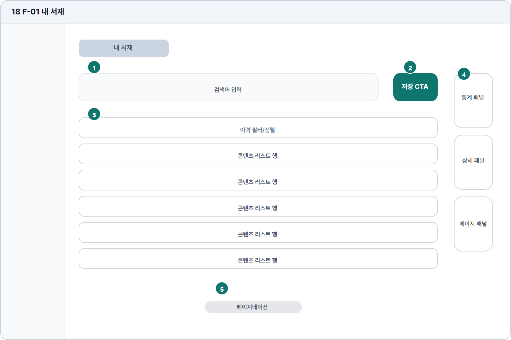

# 내 서재

- Source: 18 F-01 내 서재
- Code: F-01
- Wireframe: 

## Wireframe Number Map

| No. | Area | Description |
| --- | --- | --- |
| 1 | 검색/필터 | 저장 답안, 피드백, 문제를 유형·상태·기간 기준으로 찾음. |
| 2 | 내보내기/생성 액션 | 선택 자료를 PDF로 내보내거나 복습 세트로 생성함. |
| 3 | 저장 답안 목록 | 저장된 문제, 답안, 점수, 피드백 요약을 행 단위로 표시. |
| 4 | 우측 통계 | 저장 콘텐츠 수, 평균 점수, 취약 유형, 복습 현황을 요약함. |
| 5 | 페이지 이동 | 저장 자료가 많을 때 페이지 단위로 목록을 탐색함. |

## Detailed Description
### 18 F-01 내 서재
1

■ 검색/필터

▣ 설명

• 저장 답안, 피드백, 문제를 유형·상태·기간 기준으로 찾음.

▣ 제약 조건: 검색어 2-40자, 필터 동시 사용, 결과 수 상단 표시.

▣ 예외: 검색 결과 없음은 빈 상태와 필터 초기화 CTA 제공.

2

■ 내보내기/생성 액션

▣ 설명

• 선택 자료를 PDF로 내보내거나 복습 세트로 생성함.

▣ 제약 조건: 선택 항목 필요, 액션 3개 이하, 클릭 후 로딩 표시.

▣ 예외: 선택 없음/권한 없음/PDF 실패는 버튼 주변에 안내.

3

■ 저장 답안 목록

▣ 설명

• 저장된 문제, 답안, 점수, 피드백 요약을 행 단위로 표시.

▣ 제약 조건: 10개/페이지, 제목 32자, 미리보기 2줄, 상태 배지 1개.

▣ 예외: 빈 서재는 첫 저장 유도와 문제 풀기 CTA로 대체.

4

■ 우측 통계

▣ 설명

• 저장 콘텐츠 수, 평균 점수, 취약 유형, 복습 현황을 요약함.

▣ 제약 조건: 통계 카드 3개 이하, 수치 라벨 1줄, 최근 갱신일 표시.

▣ 예외: 데이터 없음은 통계 대신 복습 시작 안내 표시.

5

■ 페이지 이동

▣ 설명

• 저장 자료가 많을 때 페이지 단위로 목록을 탐색함.

▣ 제약 조건: 페이지 버튼 5개, 총 건수 하단 표시, 모바일은 이전/다음만.

▣ 예외: 첫/마지막 페이지는 해당 이동 버튼 비활성.

화면 목적 / 분기 / 피드백 / 예외 상황

목적

저장한 콘텐츠와 학습 자료를 관리한다.

분기

검색, 행 선택, 상세 패널, 저장/해제.

피드백

검색 결과, 선택 행 강조, 저장 상태 표시.

예외

예외: 빈 서재, 검색 없음, PDF 실패.
