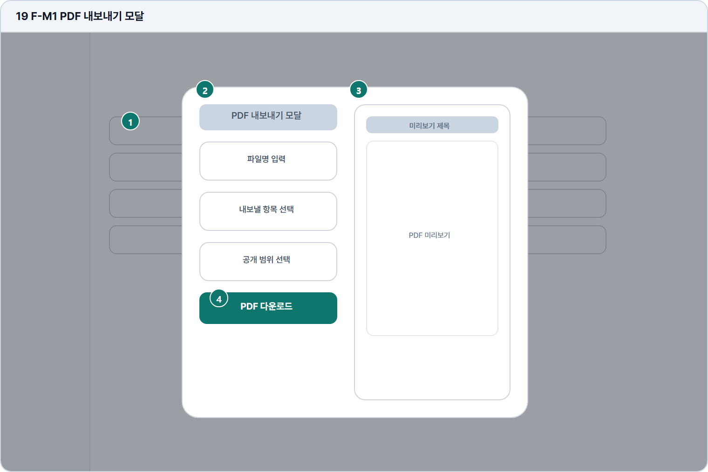

# PDF 내보내기 모달

- Source: 19 F-M1 PDF 내보내기 모달
- Code: F-M1
- Wireframe: 

## Wireframe Number Map

| No. | Area | Description |
| --- | --- | --- |
| 1 | 배경 내 서재 | 내 서재에서 PDF 내보내기 액션을 실행한 뒤의 배경 상태. |
| 2 | PDF 옵션 | 포함 항목, 정렬, 답안/피드백 포함 여부, 파일 형식을 설정함. |
| 3 | 미리보기 | PDF에 포함될 표지, 답안, 피드백 구성의 축약 미리보기. |
| 4 | 내보내기 CTA | 선택 옵션으로 PDF 생성을 시작하고 다운로드 또는 저장을 제공. |

## Detailed Description
### 19 F-M1 PDF 내보내기 모달
1

■ 배경 내 서재

▣ 설명

• 내 서재에서 PDF 내보내기 액션을 실행한 뒤의 배경 상태.

▣ 제약 조건: 배경 dim 처리, 선택 항목 유지, 목록 스크롤 잠금.

▣ 예외: 선택 항목이 사라지면 모달 대신 오류 안내 표시.

2

■ PDF 옵션

▣ 설명

• 포함 항목, 정렬, 답안/피드백 포함 여부, 파일 형식을 설정함.

▣ 제약 조건: 파일명 1-60자, 항목 6개 이하, 개인정보 확인 필수.

▣ 예외: 권한 없음/선택 없음은 옵션 영역 상단에 안내.

3

■ 미리보기

▣ 설명

• PDF에 포함될 표지, 답안, 피드백 구성의 축약 미리보기.

▣ 제약 조건: 미리보기 1페이지 축약, 긴 답안은 일부만 표시.

▣ 예외: 미리보기 생성 실패 시 텍스트 요약과 재생성 CTA 제공.

4

■ 내보내기 CTA

▣ 설명

• 선택 옵션으로 PDF 생성을 시작하고 다운로드 또는 저장을 제공.

▣ 제약 조건: 생성 중 CTA 비활성, 완료 후 다운로드 CTA 1개 노출.

▣ 예외: 생성 실패/네트워크 오류는 재시도와 문의 링크 표시.

화면 목적 / 분기 / 피드백 / 예외 상황

목적

선택 항목을 PDF로 내보내기 전 옵션을 설정한다.

분기

파일명 입력, 항목/공개 범위 선택, 다운로드.

피드백

미리보기, 파일명 검증, 다운로드 진행 표시.

예외

예외: 생성 실패, 권한 없음, 선택 없음.
