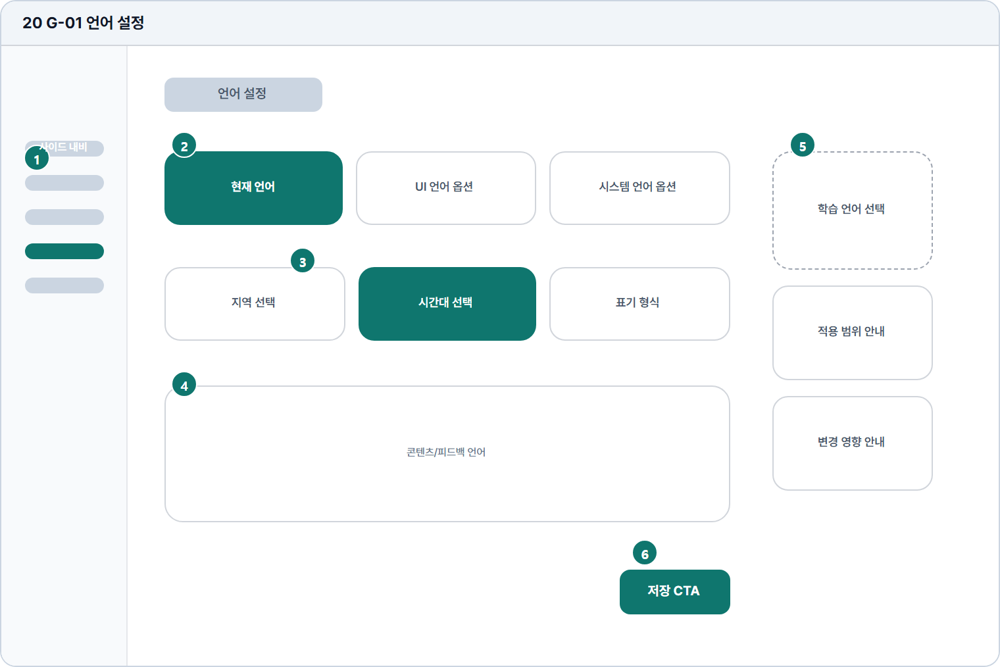

# 설정 언어

- Source: 20 G-01 설정 언어
- Code: G-01
- Wireframe: 

## Wireframe Number Map

| No. | Area | Description |
| --- | --- | --- |
| 1 | 학습자 사이드 내비 | 설정 화면에서도 학습자 기본 메뉴와 현재 위치를 유지함. |
| 2 | UI 언어 선택 | 메뉴, 버튼, 시스템 메시지에 적용될 인터페이스 언어를 선택함. |
| 3 | 학습 언어 선택 | 설명, 예시, 번역 보조 등 학습 지원 콘텐츠 기준 언어를 설정. |
| 4 | 콘텐츠 설정 | 피드백 표시, 예문 난이도, 해설 길이 등 학습 옵션을 조정함. |
| 5 | 도움말 | 언어 설정이 어느 화면에 영향을 주는지 설명하는 보조 안내. |
| 6 | 저장 | 변경한 언어/콘텐츠 설정을 확정하는 주 액션 버튼. |

## Detailed Description
### 20 G-01 설정 언어
1

■ 학습자 사이드 내비

▣ 설명

• 설정 화면에서도 학습자 기본 메뉴와 현재 위치를 유지함.

▣ 제약 조건: 설정 메뉴만 활성, 저장 전 이탈 시 변경사항 확인.

▣ 예외: 세션 만료 시 로그인 이동 안내를 표시.

2

■ UI 언어 선택

▣ 설명

• 메뉴, 버튼, 시스템 메시지에 적용될 인터페이스 언어를 선택함.

▣ 제약 조건: 언어명 원어 병기, 선택 옵션 6개 이하, 즉시 미리보기.

▣ 예외: 미지원 언어 선택 시 비활성 및 지원 예정 안내.

3

■ 학습 언어 선택

▣ 설명

• 설명, 예시, 번역 보조 등 학습 지원 콘텐츠 기준 언어를 설정.

▣ 제약 조건: 번역 문구 30% 확장 허용, 실제 다국어 문구로 검수.

▣ 예외: 번역 없음은 기본 언어와 안내 배지를 함께 표시.

4

■ 콘텐츠 설정

▣ 설명

• 피드백 표시, 예문 난이도, 해설 길이 등 학습 옵션을 조정함.

▣ 제약 조건: 옵션 그룹 3개 이하, 선택값은 저장 전까지 임시 상태.

▣ 예외: 옵션 충돌 시 저장 전 경고와 추천값 복원 제공.

5

■ 도움말

▣ 설명

• 언어 설정이 어느 화면에 영향을 주는지 설명하는 보조 안내.

▣ 제약 조건: 도움말 3항목 이하, 각 항목 60자 이하.

▣ 예외: 영향 범위 산출 실패 시 기본 적용 범위만 표시.

6

■ 저장

▣ 설명

• 변경한 언어/콘텐츠 설정을 확정하는 주 액션 버튼.

▣ 제약 조건: 변경값 없으면 비활성, 저장 중 중복 클릭 차단.

▣ 예외: 저장 실패/세션 만료는 토스트와 재로그인 안내 표시.

화면 목적 / 분기 / 피드백 / 예외 상황

목적

서비스/학습 언어와 지역 설정을 저장한다.

분기

언어/지역/학습 언어 선택 후 저장.

피드백

현재 언어 강조, 변경 미리보기, 저장 완료.

예외

예외: 미지원 언어, 저장 실패, 세션 만료.
