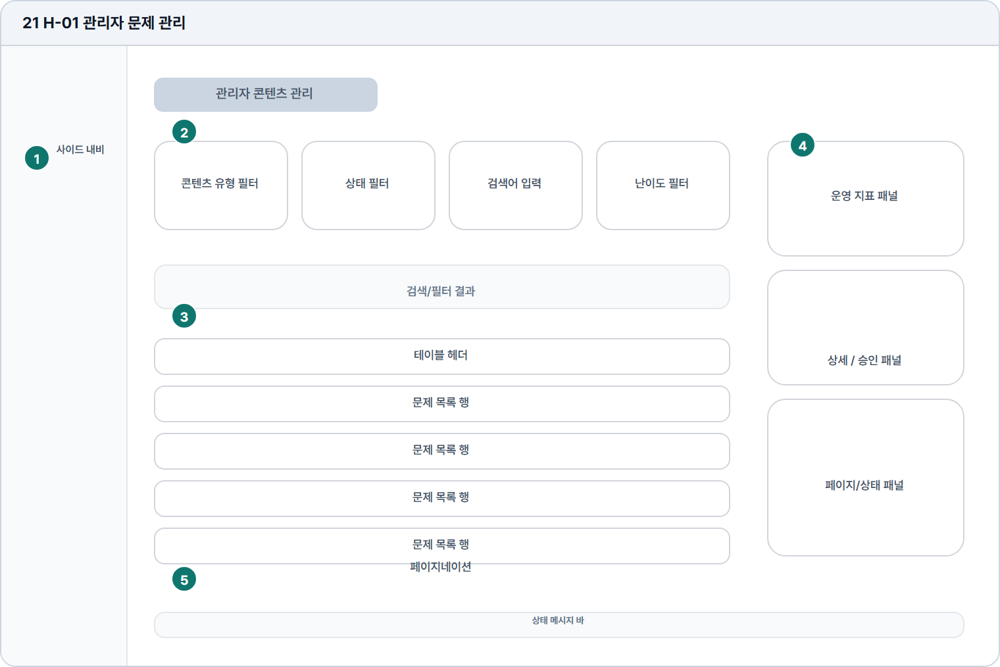

# 관리자 문제 관리

- Source: 21 H-01 관리자 문제 관리
- Code: H-01
- Wireframe: 

## Wireframe Number Map

| No. | Area | Description |
| --- | --- | --- |
| 1 | 관리자 사이드 내비 | 관리자 주요 업무 메뉴와 현재 관리 위치를 고정 표시함. |
| 2 | KPI/필터 | 전체 문제 수, 공개 상태, 검수 대기, 난이도 분포를 표시함. |
| 3 | 문제 관리 테이블 | 문제 번호, 유형, 난이도, 공개 여부, 검수 상태를 행 단위 표시. |
| 4 | 우측 상세/설정 | 선택 문제의 지문, 정답, 해설, 태그, 공개 설정을 편집함. |
| 5 | 페이지/상태 | 페이지 이동, 저장 상태, 검수 완료 여부, 오류 메시지를 표시. |

## Detailed Description
### 21 H-01 관리자 문제 관리
1

■ 관리자 사이드 내비

▣ 설명

• 관리자 주요 업무 메뉴와 현재 관리 위치를 고정 표시함.

▣ 제약 조건: 관리자 역할에서만 노출, 메뉴명 12자 이하.

▣ 예외: 권한 없음은 대시보드 접근 차단과 안내 화면 표시.

2

■ KPI/필터

▣ 설명

• 전체 문제 수, 공개 상태, 검수 대기, 난이도 분포를 표시함.

▣ 제약 조건: KPI 4개 이하, 필터와 정렬 동시 사용 가능.

▣ 예외: 데이터 로드 실패 시 KPI 스켈레톤과 재시도 제공.

3

■ 문제 관리 테이블

▣ 설명

• 문제 번호, 유형, 난이도, 공개 여부, 검수 상태를 행 단위 표시.

▣ 제약 조건: 20개/페이지, 페이지 버튼 7개, 긴 제목 말줄임.

▣ 예외: 비공개/검수 충돌 행은 상태 배지와 편집 제한 표시.

4

■ 우측 상세/설정

▣ 설명

• 선택 문제의 지문, 정답, 해설, 태그, 공개 설정을 편집함.

▣ 제약 조건: 수정 권한 필요, 저장 전 변경 항목 표시, 삭제는 확인 모달.

▣ 예외: 저장 실패/동시 수정 충돌은 패널 상단에 안내.

5

■ 페이지/상태

▣ 설명

• 페이지 이동, 저장 상태, 검수 완료 여부, 오류 메시지를 표시.

▣ 제약 조건: 상태 메시지 60자 이하, 완료/오류/로딩 구분.

▣ 예외: 검수 실패나 권한 변경은 상태 바에 즉시 표시.

화면 목적 / 분기 / 피드백 / 예외 상황

목적

관리자 콘텐츠를 검색, 승인, 관리한다.

분기

필터/검색, 테이블 선택, 상세 승인 패널.

피드백

상태 변경, 결과 수, 승인 완료를 표시한다.

예외

예외: 권한 없음, 저장 실패, 검수 충돌.
