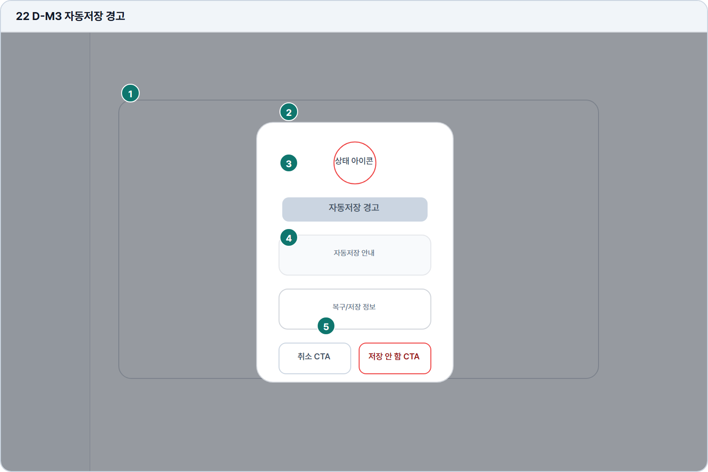

# 자동저장 경고

- Source: 22 D-M3 자동저장 경고
- Code: D-M3
- Wireframe: 

## Wireframe Number Map

| No. | Area | Description |
| --- | --- | --- |
| 1 | 배경 작성 화면 | 답안 작성 중 경고 모달이 열린 배경 상태를 보여줌. |
| 2 | 경고 아이콘 | 자동저장 해제 또는 저장 실패가 중요한 상태임을 알림. |
| 3 | 자동저장 안내 | 자동저장 해제 시 데이터 손실 위험을 설명함. |
| 4 | 복구/저장 정보 | 마지막 저장 시각, 복구 가능 여부, 임시 저장 상태를 안내함. |
| 5 | 취소/끄기 CTA | 취소는 자동저장을 유지하고, 끄기는 위험 인지 후 변경함. |

## Detailed Description
### 22 D-M3 자동저장 경고
1

■ 배경 작성 화면

▣ 설명

• 답안 작성 중 경고 모달이 열린 배경 상태를 보여줌.

▣ 제약 조건: 배경 dim 처리, 입력 잠금, 현재 작성 내용 보존.

▣ 예외: 저장 완료 전 닫기 시 손실 가능성 경고 유지.

2

■ 경고 아이콘

▣ 설명

• 자동저장 해제 또는 저장 실패가 중요한 상태임을 알림.

▣ 제약 조건: 경고 색상은 위험 상태에만 사용, 아이콘 1개 고정.

▣ 예외: 아이콘 로드 실패 시 텍스트 배지로 대체.

3

■ 자동저장 안내

▣ 설명

• 자동저장 해제 시 데이터 손실 위험을 설명함.

▣ 제약 조건: 제목 24자, 본문 80자/2줄, 손실 범위 명시.

▣ 예외: 네트워크 끊김/복구 불가는 별도 경고 문구로 표시.

4

■ 복구/저장 정보

▣ 설명

• 마지막 저장 시각, 복구 가능 여부, 임시 저장 상태를 안내함.

▣ 제약 조건: 저장 시각 필수, 복구 상태는 가능/불가/확인중으로 표시.

▣ 예외: 저장 정보 없음은 '복구 불가'와 도움말 링크 표시.

5

■ 취소/끄기 CTA

▣ 설명

• 취소는 자동저장을 유지하고, 끄기는 위험 인지 후 변경함.

▣ 제약 조건: 위험 CTA는 확인성 문구, 중복 클릭 차단.

▣ 예외: 끄기 실패 시 모달 유지와 실패 사유 표시.

화면 목적 / 분기 / 피드백 / 예외 상황

목적

저장되지 않은 변경 이탈을 방지한다.

분기

취소, 저장 안 함, 필요 시 저장 후 이동.

피드백

경고 상태, 버튼 위험도, 선택 결과를 표시.

예외

예외: 저장 실패, 네트워크 끊김, 복구 불가.
