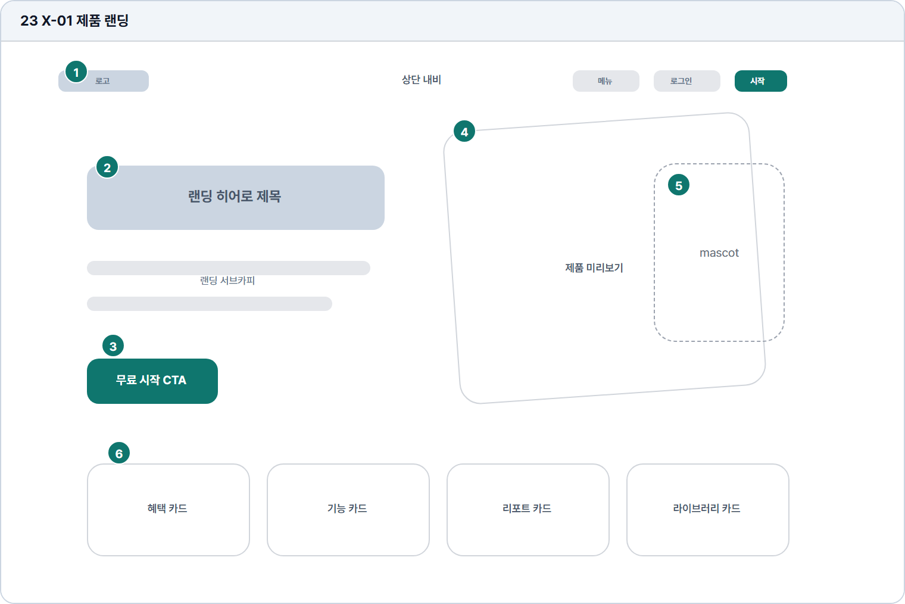

# 제품 랜딩

- Source: 23 X-01 제품 랜딩
- Code: X-01
- Wireframe: 

## Wireframe Number Map

| No. | Area | Description |
| --- | --- | --- |
| 1 | 헤더/내비 | 로고, 주요 메뉴, 로그인/시작 버튼을 제공하는 첫 탐색 영역. |
| 2 | 히어로 카피 | TOPIK 쓰기 AI 학습이라는 제품 약속을 가장 크게 전달함. |
| 3 | 시작 CTA | 회원가입 또는 무료 시작으로 연결되는 랜딩 핵심 전환 버튼. |
| 4 | 제품 프리뷰 | 대시보드, 피드백, 리포트 화면을 축약해 사용 경험을 보여줌. |
| 5 | 마스코트 | 학습 보조 캐릭터로 브랜드 친밀감과 서비스 개성을 전달함. |
| 6 | 기능 카드 | AI 첨삭, 실전 문제, 성장 리포트, 라이브러리 기능을 요약함. |

## Detailed Description
### 23 X-01 제품 랜딩
1

■ 헤더/내비

▣ 설명

• 로고, 주요 메뉴, 로그인/시작 버튼을 제공하는 첫 탐색 영역.

▣ 제약 조건: 메뉴 4개 이하, 로고 클릭은 랜딩 상단 이동.

▣ 예외: 로그인 사용자는 시작 대신 대시보드 CTA 표시.

2

■ 히어로 카피

▣ 설명

• TOPIK 쓰기 AI 학습이라는 제품 약속을 가장 크게 전달함.

▣ 제약 조건: H1 36자, 서브카피 2줄, 첫 화면에 제품 가치 노출.

▣ 예외: 긴 번역은 의미 유지 범위에서 H1과 서브를 분리.

3

■ 시작 CTA

▣ 설명

• 회원가입 또는 무료 시작으로 연결되는 랜딩 핵심 전환 버튼.

▣ 제약 조건: 대표 CTA 1개, 보조 링크 1개, 클릭 후 중복 이동 차단.

▣ 예외: 비회원 이탈/세션 보유 사용자는 적절한 다음 화면으로 분기.

4

■ 제품 프리뷰

▣ 설명

• 대시보드, 피드백, 리포트 화면을 축약해 사용 경험을 보여줌.

▣ 제약 조건: 프리뷰 3장 이하, 실제 화면 기반 문구 사용.

▣ 예외: 프리뷰 이미지 실패 시 기능 카드 요약으로 대체.

5

■ 마스코트

▣ 설명

• 학습 보조 캐릭터로 브랜드 친밀감과 서비스 개성을 전달함.

▣ 제약 조건: 첫 화면 CTA와 겹치지 않음, 대체 텍스트 필수.

▣ 예외: 이미지 미노출 환경에서는 텍스트 브랜드 톤으로 보완.

6

■ 기능 카드

▣ 설명

• AI 첨삭, 실전 문제, 성장 리포트, 라이브러리 기능을 요약함.

▣ 제약 조건: 카드 4개 이하, 제목 14자, 설명 2줄 제한.

▣ 예외: 카드가 모바일에서 길어지면 단일 컬럼으로 전환.

화면 목적 / 분기 / 피드백 / 예외 상황

목적

제품 가치와 주요 기능을 소개하고 가입을 유도한다.

분기

무료 시작, 내비 이동, 미리보기/혜택 확인.

피드백

CTA hover/press, 섹션 이동, 시작 완료.

예외

예외: 비회원 이탈, 로그인 사용자 진입.
