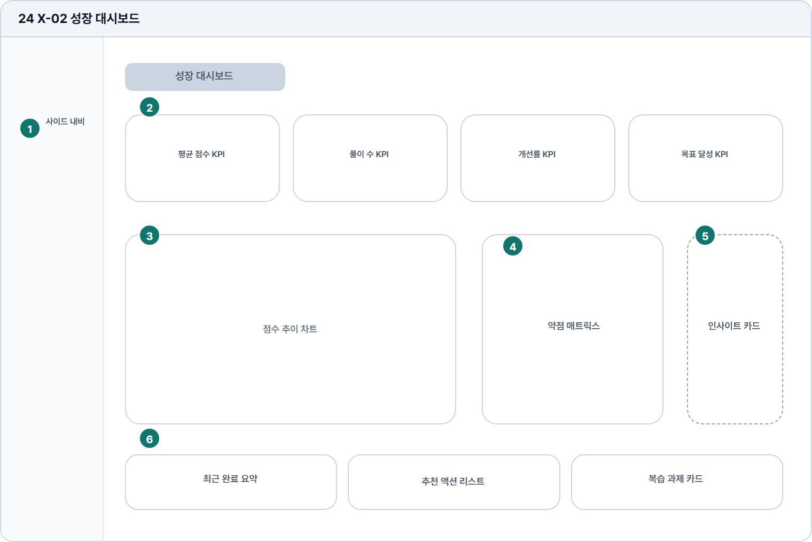

# 성장 대시보드

- Source: 24 X-02 성장 대시보드
- Code: X-02
- Wireframe: 

## Wireframe Number Map

| No. | Area | Description |
| --- | --- | --- |
| 1 | 학습자 사이드 내비 | 성장 대시보드에서도 학습자 메뉴와 현재 위치를 유지함. |
| 2 | KPI 카드 | 평균 점수, 풀이 수, 개선률, 목표 달성률을 카드로 요약함. |
| 3 | 성장 차트 | 시간 흐름에 따른 점수, 풀이량, 항목별 개선 추세를 보여줌. |
| 4 | 약점 매트릭스 | 문법, 어휘, 구성, 주제 적합성 등 약점 영역을 표현함. |
| 5 | 인사이트 | AI가 학습 패턴과 최근 성과를 짧은 문장으로 해석함. |
| 6 | 하단 요약/추천 | 최근 완료 문제, 다음 추천 문제, 복습 과제를 하단에 묶어 제공. |

## Detailed Description

### 24 X-02 성장 대시보드

1

■ 학습자 사이드 내비

▣ 설명

• 성장 대시보드에서도 학습자 메뉴와 현재 위치를 유지함.

▣ 제약 조건: 성장 리포트 메뉴만 활성, 모바일은 햄버거로 전환.

▣ 예외: 권한 없는 리포트는 잠금 안내와 업그레이드 CTA 표시.

2

■ KPI 카드

▣ 설명

• 평균 점수, 풀이 수, 개선률, 목표 달성률을 카드로 요약함.

▣ 제약 조건: KPI 4개 고정, 수치/증감/기간을 같은 순서로 표시.

▣ 예외: 목표 없음/데이터 없음은 설정 유도 카드로 대체.

3

■ 성장 차트

▣ 설명

• 시간 흐름에 따른 점수, 풀이량, 항목별 개선 추세를 보여줌.

▣ 제약 조건: 기간 필터 4개 이하, 범례 5개 이하.

▣ 예외: 차트 로드 실패 시 재시도 버튼 제공.

4

■ 약점 매트릭스

▣ 설명

• 문법, 어휘, 구성, 주제 적합성 등 약점 영역을 표현함.

▣ 제약 조건: 영역 6개 이하, 색상만으로 의미 전달 금지.

▣ 예외: 데이터 부족 시 최근 답안 기반 안내와 학습 시작 CTA 표시.

5

■ 인사이트

▣ 설명

• AI가 학습 패턴과 최근 성과를 짧은 문장으로 해석함.

▣ 제약 조건: 인사이트 3개 이하, 문장당 60자 이하, 실제 수치 근거 포함.

▣ 예외: 인사이트 생성 실패 시 기본 학습 팁으로 대체.

6

■ 하단 요약/추천

▣ 설명

• 최근 완료 문제, 다음 추천 문제, 복습 과제를 하단에 묶어 제공.

▣ 제약 조건: 추천 5개 이하, 320px 이하는 카드 단일 컬럼.

▣ 예외: 추천 없음은 최근 완료 요약과 문제 목록 CTA만 표시.

화면 목적 / 분기 / 피드백 / 예외 상황

목적

성장 지표와 추천 액션을 한 화면에서 확인한다.

분기

KPI/차트 확인, 추천 액션 선택.

피드백

지표 갱신, 차트 상태, 액션 완료 표시.

예외

예외: 데이터 없음, 차트 로드 실패, 목표 없음.
