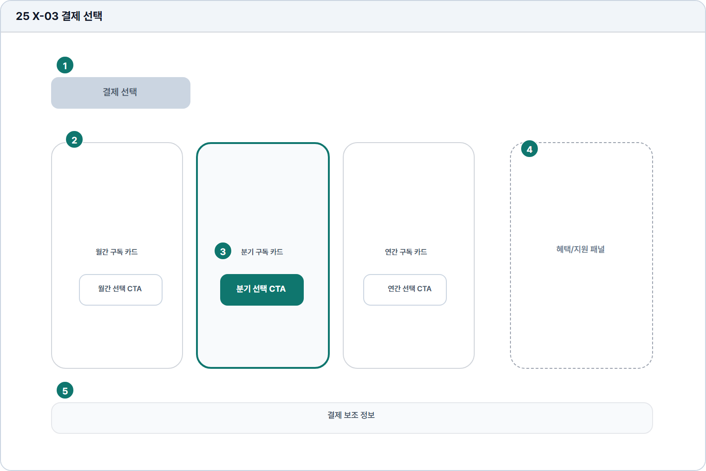

# 페이월

- Source: 25 X-03 페이월
- Code: X-03
- Wireframe: 

## Wireframe Number Map

| No. | Area | Description |
| --- | --- | --- |
| 1 | 결제 선택 제목 | 유료 기능 진입 시 단일 구독 결제 선택 단계임을 안내함. |
| 2 | 결제 주기 카드 3열 | 월간, 분기, 연간 결제 주기를 카드로 비교 배치함. |
| 3 | 결제 주기 선택 CTA | 선택한 결제 주기로 구독 절차를 시작하는 버튼. |
| 4 | 혜택/지원 패널 | 첨삭 횟수, 리포트, PDF 등 핵심 혜택을 정리함. |
| 5 | 결제 보조 정보 | 환불, 세금계산서, 보안 결제, 기관 문의 같은 우려를 안내함. |

## Detailed Description

### 25 X-03 페이월

1

■ 결제 선택 제목

▣ 설명

• 유료 기능 진입 시 단일 구독 결제 선택 단계임을 안내함.

▣ 제약 조건: 제목 24자, 보조 설명 80자/2줄, 가격 정보와 분리.

▣ 예외: 기존 구독자는 결제 선택 대신 구독 관리로 유도.

2

■ 결제 주기 카드 3열

▣ 설명

• 월간, 분기, 연간 결제 주기를 카드로 비교 배치함.

▣ 제약 조건: 카드 3개 고정, 혜택 4개 이하, 추천 배지 1개만 표시.

▣ 예외: 프로모션 없음/가격 조회 실패 시 기본 가격 문구로 대체.

3

■ 결제 주기 선택 CTA

▣ 설명

• 선택한 결제 주기로 구독 절차를 시작하는 버튼.

▣ 제약 조건: 카드별 CTA 1개, 선택 후 중복 클릭 차단, 로딩 표시.

▣ 예외: 결제 실패/미지원 수단/중복 구독은 버튼 하단에 안내.

4

■ 혜택/지원 패널

▣ 설명

• 첨삭 횟수, 리포트, PDF 등 핵심 혜택을 정리함.

▣ 제약 조건: 혜택 4개 이하, 항목명 18자, 지원 문의 CTA 1개.

▣ 예외: 혜택 정보 조회 실패 시 기본 구독 설명만 표시.

5

■ 결제 보조 정보

▣ 설명

• 환불, 세금계산서, 보안 결제, 기관 문의 같은 우려를 안내함.

▣ 제약 조건: 안내 4항목 이하, 정책 링크는 외부 이동 표시.

▣ 예외: 정책 변경/미확인 정보는 고객지원 문의로 연결.

화면 목적 / 분기 / 피드백 / 예외 상황

목적

결제 주기를 비교하고 단일 구독을 시작한다.

분기

월/분기/연 선택, 보조 정보 확인, 구독 CTA.

피드백

선택 주기 강조, 결제 준비, 구독 완료.

예외

예외: 결제 실패, 미지원 수단, 중복 구독.
