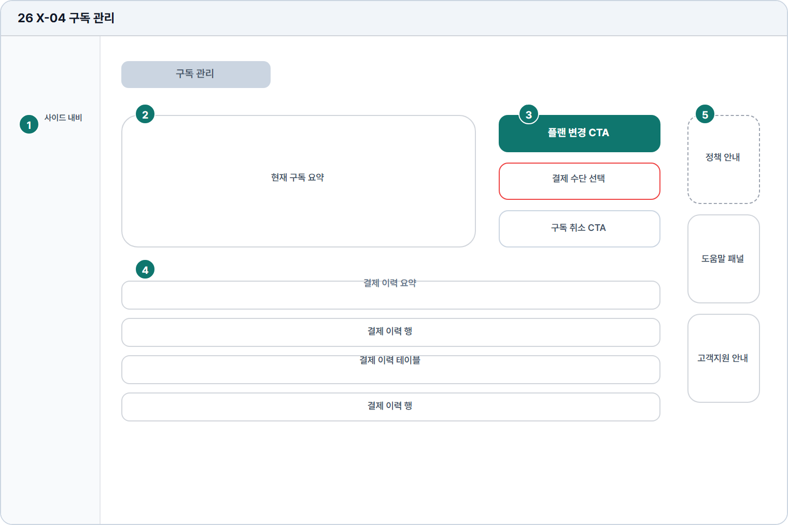

# 구독 관리

- Source: 26 X-04 구독 관리
- Code: X-04
- Wireframe: 

## Wireframe Number Map

| No. | Area | Description |
| --- | --- | --- |
| 1 | 학습자 사이드 내비 | 구독 관리 화면에서도 학습자 메뉴와 설정 위치를 유지함. |
| 2 | 현재 구독 요약 | 플랜명, 결제 주기, 다음 결제일, 사용량 제한을 요약함. |
| 3 | 변경/취소 액션 | 플랜 변경, 구독 취소, 결제수단 변경을 실행함. |
| 4 | 결제 이력 | 결제일, 금액, 상태, 영수증 다운로드 링크를 표로 제공함. |
| 5 | 우측 도움말 | 구독 변경 정책, 환불 기준, 플랜 차이, 고객지원을 안내함. |

## Detailed Description

### 26 X-04 구독 관리

1

■ 학습자 사이드 내비

▣ 설명

• 구독 관리 화면에서도 학습자 메뉴와 설정 위치를 유지함.

▣ 제약 조건: 설정/구독 메뉴만 활성, 관리자 메뉴는 노출하지 않음.

▣ 예외: 미로그인/세션 만료는 로그인 화면으로 리다이렉트.

2

■ 현재 구독 요약

▣ 설명

• 플랜명, 결제 주기, 다음 결제일, 사용량 제한을 요약함.

▣ 제약 조건: 요약 4항목 이하, 날짜는 로케일 형식, 금액은 통화 병기.

▣ 예외: 구독 없음/결제 실패 상태는 별도 배지로 표시.

3

■ 변경/취소 액션

▣ 설명

• 플랜 변경, 구독 취소, 결제수단 변경을 실행함.

▣ 제약 조건: 취소/변경은 정책 모달 필수, 위험 CTA는 별도 스타일.

▣ 예외: 취소 예약/변경 불가 기간은 비활성 사유를 표시.

4

■ 결제 이력

▣ 설명

• 결제일, 금액, 상태, 영수증 다운로드 링크를 표로 제공함.

▣ 제약 조건: 10개/페이지, 금액/상태 고정 열, 영수증 링크 1개.

▣ 예외: 이력 조회 실패는 빈 표와 재시도 CTA 표시.

5

■ 우측 도움말

▣ 설명

• 구독 변경 정책, 환불 기준, 플랜 차이, 고객지원을 안내함.

▣ 제약 조건: 도움말 4항목 이하, 정책 문구 2줄 제한.

▣ 예외: 정책 정보 미확인 시 고객지원 CTA를 우선 표시.

화면 목적 / 분기 / 피드백 / 예외 상황

목적

현재 구독과 결제 이력을 관리한다.

분기

플랜 변경, 결제수단 선택, 이력 확인.

피드백

현재 플랜, 결제 상태, 변경 완료 표시.

예외

예외: 결제 실패, 취소 예약, 이력 조회 실패.
