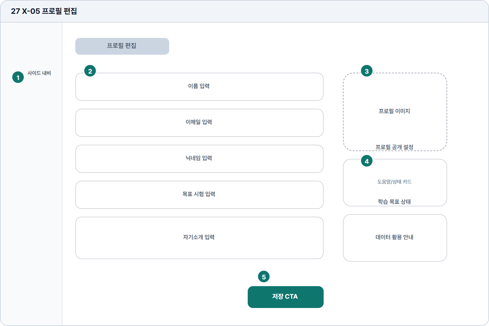

# 프로필 편집

- Source: 27 X-05 프로필 편집
- Code: X-05
- Wireframe: 

## Wireframe Number Map

| No. | Area | Description |
| --- | --- | --- |
| 1 | 학습자 사이드 내비 | 프로필 편집 중에도 학습자 앱의 현재 위치를 유지함. |
| 2 | 개인정보 입력 폼 | 이름, 닉네임, 이메일, 목표 시험 정보 등 기본 정보를 수정함. |
| 3 | 아바타 영역 | 사용자 이미지 또는 기본 캐릭터를 등록/변경하는 영역. |
| 4 | 도움말/상태 카드 | 공개 범위, 데이터 활용, 학습 목표 반영 여부를 안내함. |
| 5 | 저장 CTA | 변경된 프로필 정보를 저장하는 주 액션 버튼. |

## Detailed Description

### 27 X-05 프로필 편집

1

■ 학습자 사이드 내비

▣ 설명

• 프로필 편집 중에도 학습자 앱의 현재 위치를 유지함.

▣ 제약 조건: 설정/프로필 메뉴 활성, 저장 전 이탈 확인 적용.

▣ 예외: 재인증 필요 시 프로필 입력 전 보안 안내 표시.

2

■ 개인정보 입력 폼

▣ 설명

• 이름, 닉네임, 이메일, 목표 시험 정보 등 기본 정보를 수정함.

▣ 제약 조건: 이름 2-30자, 닉네임 2-20자, 자기소개 160자 이하.

▣ 예외: 중복 닉네임/이메일 변경 제한은 필드 하단에 표시.

3

■ 아바타 영역

▣ 설명

• 사용자 이미지 또는 기본 캐릭터를 등록/변경하는 영역.

▣ 제약 조건: 이미지 5MB 이하, jpg/png 허용, 정사각형 크롭 제공.

▣ 예외: 업로드 실패/부적합 파일은 즉시 오류와 재선택 제공.

4

■ 도움말/상태 카드

▣ 설명

• 공개 범위, 데이터 활용, 학습 목표 반영 여부를 안내함.

▣ 제약 조건: 카드 3개 이하, 안내문 2줄, 공개 상태 배지 필수.

▣ 예외: 정책 미동의/데이터 활용 제한은 별도 경고 표시.

5

■ 저장 CTA

▣ 설명

• 변경된 프로필 정보를 저장하는 주 액션 버튼.

▣ 제약 조건: 변경값 없으면 비활성, 저장 중 중복 클릭 차단.

▣ 예외: 저장 실패/재인증 필요 시 현재 입력값을 보존하고 안내.

화면 목적 / 분기 / 피드백 / 예외 상황

목적

사용자 기본 정보와 프로필 이미지를 수정한다.

분기

입력 수정, 이미지 변경, 저장.

피드백

필드 검증, 이미지 업로드, 저장 완료 표시.

예외

예외: 재인증 필요, 업로드 실패, 저장 실패.
