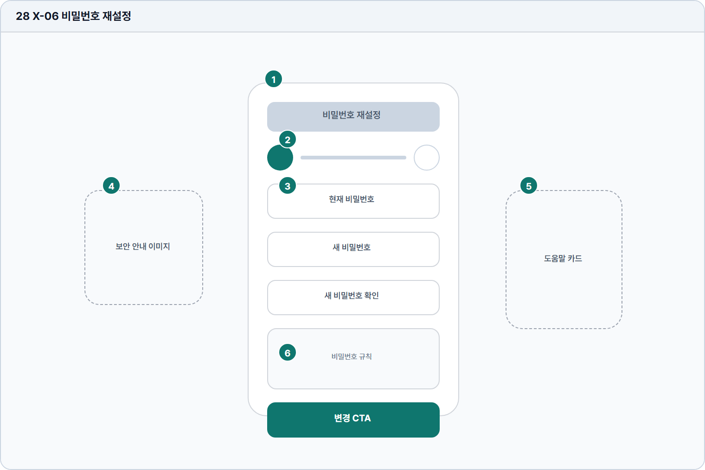

# 비밀번호 재설정

- Source: 28 X-06 비밀번호 재설정
- Code: X-06
- Wireframe: 

## Wireframe Number Map

| No. | Area | Description |
| --- | --- | --- |
| 1 | 재설정 카드 | 비밀번호 재설정 절차 전체를 담는 중앙 컨테이너. |
| 2 | 단계 표시 | 이메일 확인, 인증 코드, 새 비밀번호 설정, 완료 단계를 표시함. |
| 3 | 비밀번호 입력 | 새 비밀번호와 확인값을 입력하고 강도 조건을 검증함. |
| 4 | 안내 카피 | 보안 조건, 링크 만료, 재전송 가능 여부를 설명함. |
| 5 | 마스코트 | 보안 절차에서 느끼는 긴장감을 낮추는 보조 시각 요소. |
| 6 | 완료 CTA | 새 비밀번호 저장 또는 로그인 화면 복귀를 수행하는 최종 액션. |

## Detailed Description

### 28 X-06 비밀번호 재설정

1

■ 재설정 카드

▣ 설명

• 비밀번호 재설정 절차 전체를 담는 중앙 컨테이너.

▣ 제약 조건: 카드 폭 360-520px, 입력 흐름은 현재/새/확인 순서.

▣ 예외: 링크 만료 또는 세션 만료 시 재요청 화면으로 전환.

2

■ 단계 표시

▣ 설명

• 이메일 확인, 인증 코드, 새 비밀번호 설정, 완료 단계를 표시함.

▣ 제약 조건: 단계 4개 이하, 현재 단계와 완료 단계 구분.

▣ 예외: 외부 링크 진입 시 이전 단계는 축약 표시.

3

■ 비밀번호 입력

▣ 설명

• 새 비밀번호와 확인값을 입력하고 강도 조건을 검증함.

▣ 제약 조건: PW 8-64자, 규칙 실시간 검증, 확인값 일치 검사.

▣ 예외: 불일치/약한 비밀번호는 필드 하단에 즉시 표시.

4

■ 안내 카피

▣ 설명

• 보안 조건, 링크 만료, 재전송 가능 여부를 설명함.

▣ 제약 조건: 안내문 80자/2줄, 만료 시간은 절대/상대 시간 병기.

▣ 예외: 재전송 제한 중에는 남은 시간을 표시.

5

■ 마스코트

▣ 설명

• 보안 절차에서 느끼는 긴장감을 낮추는 보조 시각 요소.

▣ 제약 조건: 입력 영역을 가리지 않음, 대체 텍스트 필수.

▣ 예외: 이미지 실패 시 보안 안내 카피를 우선 노출.

6

■ 완료 CTA

▣ 설명

• 새 비밀번호 저장 또는 로그인 화면 복귀를 수행하는 최종 액션.

▣ 제약 조건: 성공 후 재로그인 필요 안내, 클릭 후 중복 제출 차단.

▣ 예외: 저장 실패/만료는 재시도와 링크 재발송 CTA 제공.

화면 목적 / 분기 / 피드백 / 예외 상황

목적

계정 보안을 위해 비밀번호를 변경한다.

분기

현재/새 비밀번호 입력, 보안 안내 확인, 변경.

피드백

강도/일치 여부, 변경 완료, 오류 안내.

예외

예외: 링크 만료, 비밀번호 불일치, 세션 만료.
