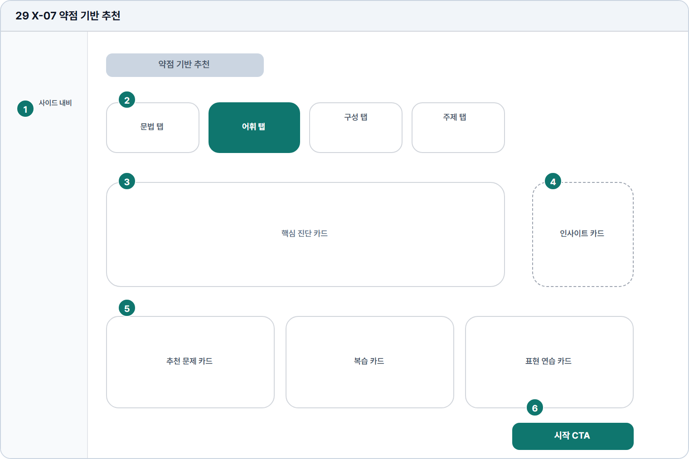

# 약점 기반 추천

- Source: 29 X-07 약점 기반 추천
- Code: X-07
- Wireframe: 

## Wireframe Number Map

| No. | Area | Description |
| --- | --- | --- |
| 1 | 학습자 사이드 내비 | 약점 추천 화면에서도 학습자 메뉴와 현재 위치를 유지함. |
| 2 | 약점 탭 | 문법, 어휘, 구성, 주제 적합성 등 약점 유형을 전환함. |
| 3 | 핵심 진단 카드 | 우선 개선해야 할 약점과 근거를 크게 보여줌. |
| 4 | 인사이트 보조 | 약점 발생 이유, 예시 오류, 개선 전략을 짧게 보완함. |
| 5 | 추천 학습 카드 | 약점에 맞는 문제, 복습 자료, 표현 연습을 추천함. |
| 6 | 시작 CTA | 선택 추천 학습을 바로 시작하거나 문제 목록으로 이동함. |

## Detailed Description

### 29 X-07 약점 기반 추천

1

■ 학습자 사이드 내비

▣ 설명

• 약점 추천 화면에서도 학습자 메뉴와 현재 위치를 유지함.

▣ 제약 조건: 성장/추천 관련 메뉴 활성, 모바일은 접힘 내비 사용.

▣ 예외: 유료 잠금이면 추천 본문 대신 업그레이드 안내 표시.

2

■ 약점 탭

▣ 설명

• 문법, 어휘, 구성, 주제 적합성 등 약점 유형을 전환함.

▣ 제약 조건: 탭 4개, 탭 라벨 10자 이하, 선택 탭 1개만 활성.

▣ 예외: 답안 부족 탭은 비활성 및 필요한 답안 수 표시.

3

■ 핵심 진단 카드

▣ 설명

• 우선 개선해야 할 약점과 근거를 크게 보여줌.

▣ 제약 조건: 진단 제목 28자, 근거 2줄, 최근 답안 날짜 표시.

▣ 예외: 추천 없음/분석 실패는 빈 상태와 다시 분석 CTA 표시.

4

■ 인사이트 보조

▣ 설명

• 약점 발생 이유, 예시 오류, 개선 전략을 짧게 보완함.

▣ 제약 조건: 인사이트 3개 이하, 각 문장 60자 이하.

▣ 예외: 인사이트 부족 시 일반 학습 팁으로 대체.

5

■ 추천 학습 카드

▣ 설명

• 약점에 맞는 문제, 복습 자료, 표현 연습을 추천함.

▣ 제약 조건: 카드 4개 이하, 제목 28자, 추천 사유 1줄.

▣ 예외: 유료 잠금/자료 없음은 비활성 카드와 안내 표시.

6

■ 시작 CTA

▣ 설명

• 선택 추천 학습을 바로 시작하거나 문제 목록으로 이동함.

▣ 제약 조건: 대표 CTA 1개, 클릭 후 중복 실행 차단.

▣ 예외: 시작 실패/선택 없음은 CTA 비활성과 오류 표시.

화면 목적 / 분기 / 피드백 / 예외 상황

목적

약점 영역별 맞춤 문제와 복습 카드를 제공한다.

분기

탭 변경, 추천 문제 시작, 인사이트 확인.

피드백

활성 탭, 추천 근거, 시작 상태 표시.

예외

예외: 답안 부족, 추천 없음, 유료 잠금.
