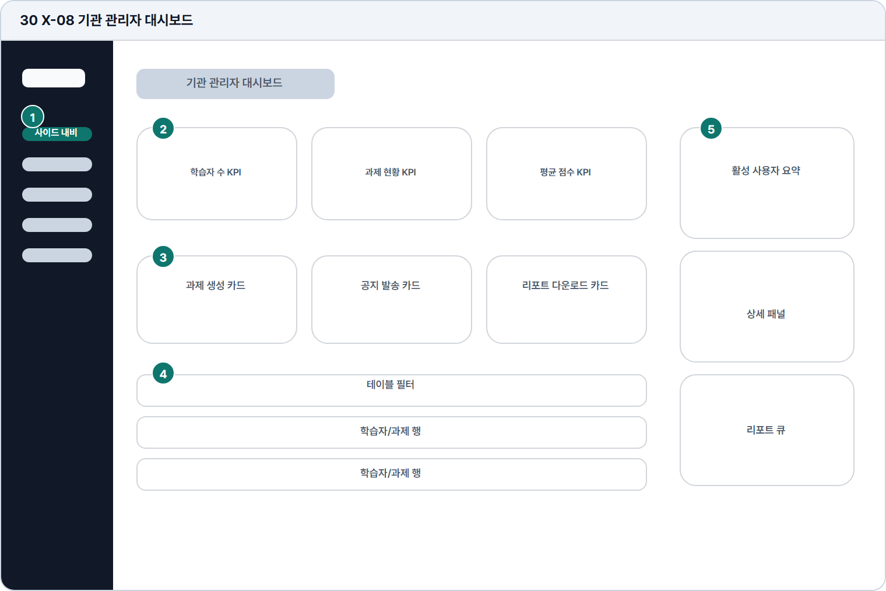

# 기관 관리자 대시보드

- Source: 30 X-08 기관 관리자 대시보드
- Code: X-08
- Wireframe: 

## Wireframe Number Map

| No. | Area | Description |
| --- | --- | --- |
| 1 | 관리자 사이드 내비 | 기관 관리자 메뉴와 대시보드 현재 위치를 고정함. |
| 2 | KPI 현황 | 학습자 수, 과제 제출률, 평균 점수, 활성 사용자 수를 요약함. |
| 3 | 운영 카드 | 과제 생성, 공지 발송, 리포트 다운로드 등 운영 작업을 카드화함. |
| 4 | 사용자/과제 테이블 | 학습자별 제출 현황, 점수, 과제 상태, 최근 활동을 표로 표시. |
| 5 | 우측 상세 패널 | 선택 사용자 또는 과제의 상세 정보, 최근 피드백, 조치 버튼 제공. |

## Detailed Description

### 30 X-08 기관 관리자 대시보드

1

■ 관리자 사이드 내비

▣ 설명

• 기관 관리자 메뉴와 대시보드 현재 위치를 고정함.

▣ 제약 조건: 기관 관리자 역할에서만 노출, 메뉴명 12자 이하.

▣ 예외: 기관 없음/권한 없음은 접근 제한 화면으로 전환.

2

■ KPI 현황

▣ 설명

• 학습자 수, 과제 제출률, 평균 점수, 활성 사용자 수를 요약함.

▣ 제약 조건: KPI 4개, 수치/기간/증감 동일 순서, 로딩 스켈레톤 제공.

▣ 예외: 데이터 없음은 0 대신 온보딩 안내로 대체.

3

■ 운영 카드

▣ 설명

• 과제 생성, 공지 발송, 리포트 다운로드 등 운영 작업을 카드화함.

▣ 제약 조건: 카드 3개 이하, 카드 CTA 1개, 권한별 노출 제어.

▣ 예외: 권한 없음/일괄 처리 실패는 카드 내부에 사유 표시.

4

■ 사용자/과제 테이블

▣ 설명

• 학습자별 제출 현황, 점수, 과제 상태, 최근 활동을 표로 표시.

▣ 제약 조건: 15개/페이지, 필터 동시 사용, 테이블 가로 스크롤 허용.

▣ 예외: 결과 없음/로드 실패는 빈 상태와 재시도 CTA 제공.

5

■ 우측 상세 패널

▣ 설명

• 선택 사용자 또는 과제의 상세 정보, 최근 피드백, 조치 버튼 제공.

▣ 제약 조건: 선택 행 필요, 상세 액션 4개 이하, 민감 정보 마스킹.

▣ 예외: 선택 없음/권한 부족은 안내 패널로 대체.

화면 목적 / 분기 / 피드백 / 예외 상황

목적

기관 학습 현황과 운영 지표를 관리한다.

분기

KPI 확인, 운영 카드, 테이블/상세 패널.

피드백

데이터 갱신, 선택 행 강조, 상태 변경 표시.

예외

예외: 권한 없음, 기관 없음, 일괄 처리 실패.
