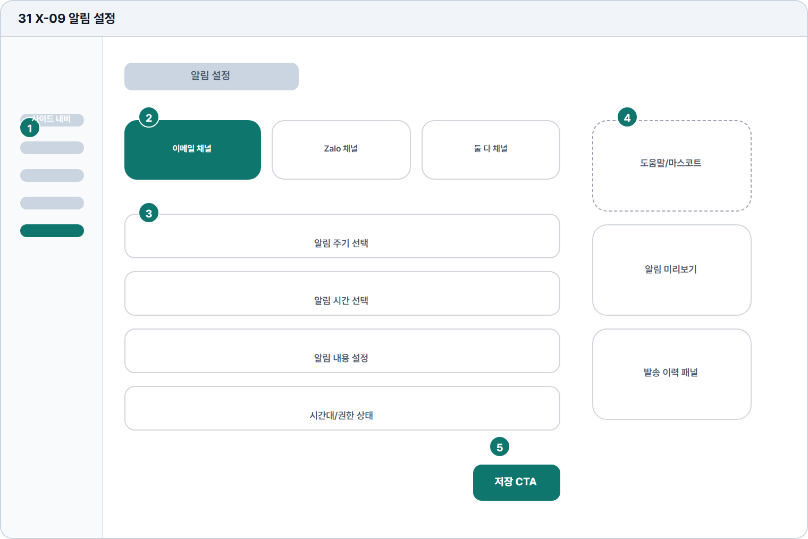

# 알림 설정

- Source: 31 X-09 알림 설정
- Code: X-09
- Wireframe: 

## Wireframe Number Map

| No. | Area | Description |
| --- | --- | --- |
| 1 | 학습자 사이드 내비 | 알림 설정 화면에서도 학습자 메뉴와 설정 위치를 유지함. |
| 2 | 알림 채널 탭 | 이메일, Zalo, 둘 다 채널을 전환하고 연동 상태를 표시함. |
| 3 | 알림 조건 입력 | 리마인더 시간, 마감 알림, 피드백 완료 알림 조건을 설정함. |
| 4 | 미리보기/도움말 | 설정한 알림의 실제 문구와 발송 시점 예시를 보여줌. |
| 5 | 저장 CTA | 변경한 알림 조건과 채널 설정을 저장하는 주 액션. |

## Detailed Description

### 31 X-09 알림 설정

1

■ 학습자 사이드 내비

▣ 설명

• 알림 설정 화면에서도 학습자 메뉴와 설정 위치를 유지함.

▣ 제약 조건: 설정 메뉴 활성, 변경값 존재 시 이탈 확인.

▣ 예외: 수신 권한 없음은 설정 본문에 권한 안내 우선 표시.

2

■ 알림 채널 탭

▣ 설명

• 이메일, Zalo, 둘 다 채널을 전환하고 연동 상태를 표시함.

▣ 제약 조건: 채널 3개 이하, 선택 탭 1개, 미연동 채널은 비활성.

▣ 예외: 채널 미연동/수신동의 없음은 탭 하단에 안내.

3

■ 알림 조건 입력

▣ 설명

• 리마인더 시간, 마감 알림, 피드백 완료 알림 조건을 설정함.

▣ 제약 조건: 시간 HH:mm, 주기 5개 이하, off 채널 설정 비활성.

▣ 예외: 시간대 오류/권한 없음은 해당 항목 하단에 표시.

4

■ 미리보기/도움말

▣ 설명

• 설정한 알림의 실제 문구와 발송 시점 예시를 보여줌.

▣ 제약 조건: 미리보기 1개, 예시 문구 80자/2줄, 발송 이력 5개.

▣ 예외: 발송 실패/미리보기 실패는 재시도와 채널 설정 링크 제공.

5

■ 저장 CTA

▣ 설명

• 변경한 알림 조건과 채널 설정을 저장하는 주 액션.

▣ 제약 조건: 변경값 없으면 비활성, 저장 중 중복 클릭 차단.

▣ 예외: 저장 실패/권한 없음은 토스트와 항목별 오류 표시.

화면 목적 / 분기 / 피드백 / 예외 상황

목적

알림 채널과 수신 조건을 설정한다.

분기

이메일/푸시 선택, 토글 변경, 저장.

피드백

활성 채널, 토글 상태, 저장 완료 표시.

예외

예외: 채널 미연동, 수신동의 없음, 발송 실패.
