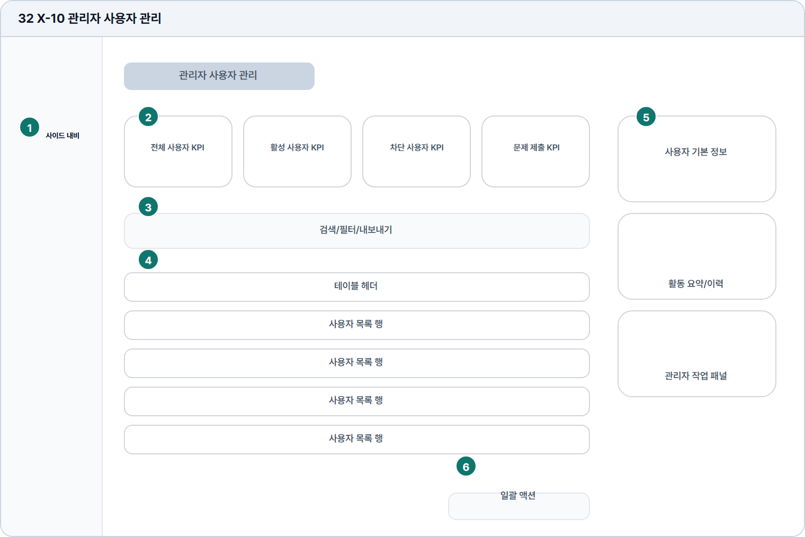

# 관리자 사용자 관리

- Source: 32 X-10 관리자 사용자 관리
- Code: X-10
- Wireframe: 

## Wireframe Number Map

| No. | Area | Description |
| --- | --- | --- |
| 1 | 관리자 사이드 내비 | 사용자 관리 화면의 관리자 메뉴와 현재 위치를 유지함. |
| 2 | 사용자 KPI/필터 | 전체/활성/차단 사용자와 제출 수를 운영 지표로 표시함. |
| 3 | 검색/정렬 | 이름, 이메일, 기관명, 사용자 ID로 검색하고 활동순 정렬함. |
| 4 | 사용자 테이블 | 사용자명, 이메일, 상태, 최근 활동, 로그인, 제출 수를 행 단위 표시. |
| 5 | 상세 패널 | 선택 사용자의 학습 기록, 결제 상태, 기관 소속, 권한을 확인함. |
| 6 | 일괄/상태 액션 | 선택 사용자에게 권한 변경, 알림 발송, 내보내기, 비활성화를 적용함. |

## Detailed Description

### 32 X-10 관리자 사용자 관리

1

■ 관리자 사이드 내비

▣ 설명

• 사용자 관리 화면의 관리자 메뉴와 현재 위치를 유지함.

▣ 제약 조건: 관리자 역할 전용, 사용자 관리 메뉴만 활성.

▣ 예외: 권한 충돌/세션 만료는 접근 제한 안내로 전환.

2

■ 사용자 KPI/필터

▣ 설명

• 전체/활성/차단 사용자와 제출 수를 운영 지표로 표시함.

▣ 제약 조건: KPI 4개, 필터 5개 이하, 결과 수 상단 표시.

▣ 예외: 사용자 없음/데이터 실패는 빈 상태와 재시도 제공.

3

■ 검색/정렬

▣ 설명

• 이름, 이메일, 기관명, 사용자 ID로 검색하고 활동순 정렬함.

▣ 제약 조건: 검색 2-60자, 정렬 1개, 개인정보는 일부 마스킹.

▣ 예외: 검색 결과 없음은 필터 초기화와 전체 목록 CTA 제공.

4

■ 사용자 테이블

▣ 설명

• 사용자명, 이메일, 상태, 최근 활동, 로그인, 제출 수를 행 단위 표시.

▣ 제약 조건: 20개/페이지, 긴 이메일 말줄임, 행 선택 단일/다중 지원.

▣ 예외: 차단/비활성 사용자는 상태 배지와 액션 제한 표시.

5

■ 상세 패널

▣ 설명

• 선택 사용자의 학습 기록, 결제 상태, 기관 소속, 권한을 확인함.

▣ 제약 조건: 선택 사용자 필요, 민감 정보 마스킹, 액션 로그 표시.

▣ 예외: 권한 부족/사용자 삭제됨은 패널 잠금 안내 표시.

6

■ 일괄/상태 액션

▣ 설명

• 선택 사용자에게 권한 변경, 알림 발송, 내보내기, 비활성화를 적용함.

▣ 제약 조건: 삭제 대신 비활성화, 위험 액션은 확인 모달 필수.

▣ 예외: 일괄 처리 실패/권한 충돌은 실패 행 목록으로 안내.

화면 목적 / 분기 / 피드백 / 예외 상황

목적

사용자를 검색하고 권한/상세 정보를 관리한다.

분기

KPI/필터, 검색, 테이블 선택, 일괄 액션.

피드백

결과 수, 선택 사용자, 권한 변경 완료 표시.

예외

예외: 권한 충돌, 사용자 없음, 일괄 처리 실패.
