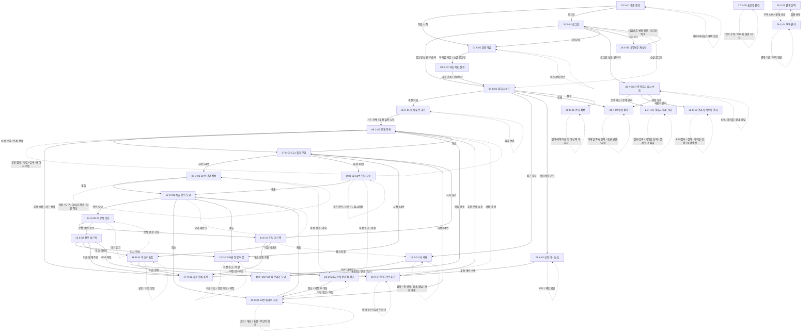

```mermaid
flowchart TD
  X01["23 X-01 제품 랜딩"]
  A01["01 A-01 회원가입"]
  A02["02 A-02 로그인"]
  X06["28 X-06 비밀번호 재설정"]
  A03["03 A-03 학습 목표 설정"]
  B01["04 B-01 홈 대시보드"]

  X01 -->|"무료 시작"| A01
  X01 -->|"로그인"| A02
  X01 -. "내비/미리보기/혜택 확인" .-> X01

  A01 -->|"이메일 가입 / 소셜 로그인"| A03
  A01 -. "약관/혜택 확인" .-> A01

  A02 -->|"로그인 성공: 학습자"| B01
  A02 -->|"로그인 성공: 관리자"| X08
  A02 -->|"회원가입"| A01
  A02 -->|"계정 찾기"| X06
  A02 -. "소셜 로그인" .-> B01

  X06 -->|"비밀번호 변경 완료 / 로그인 복귀"| A02
  A03 -->|"다음 단계 / 건너뛰기"| B01

  B01 -->|"추천 학습"| C01
  B01 -->|"최근 첨삭"| F01
  B01 -->|"목표/성장 카드"| X02
  B01 -->|"알림"| X09
  B01 -->|"설정"| G01

  C01["05 C-01 문제 유형 추천"]
  C02["06 C-02 문제 목록"]
  C03["07 C-03 다시 풀기 모달"]
  D01["08 D-01 51번 단답 작성"]
  D02["09 D-02 52번 단답 작성"]
  D03["10 D-03 53번 장문 작성"]
  D04["11 D-04 54번 에세이 작성"]
  DM1["12 D-M1 제출 확인 모달"]
  DM2["13 D-M2 AI 분석 로딩"]
  DM3["22 D-M3 자동저장 꺼짐 경고"]
  E01["14 E-01 단답 피드백"]
  E02["15 E-02 장문 피드백"]
  R01["16 R-01 비교 리포트"]
  R02["17 R-02 다음 문제 추천"]

  C01 -->|"카드 선택 / 추천 유형 시작"| C02
  C01 -. "필터 변경" .-> C01
  C02 -->|"상세 보기 / 문제 선택"| C03
  C02 -. "유형 필터 / 정렬 / 검색 / 페이지 이동" .-> C02

  C03 -->|"시작: 51번"| D01
  C03 -->|"시작: 52번"| D02
  C03 -->|"시작: 53번"| D03
  C03 -->|"시작: 54번"| D04
  C03 -->|"취소"| C02

  D01 -->|"제출"| DM1
  D02 -->|"제출"| DM1
  D03 -->|"제출"| DM1
  D04 -->|"제출"| DM1
  D01 -. "저장 / 도구 / 이미지 확인 / 답안 작성" .-> D01
  D02 -. "조건 확인 / 가이드 / 임시저장" .-> D02
  D03 -. "자료 카드 / 본문 편집 / 저장" .-> D03
  D04 -. "조건 / 개요 / 표현 / 루브릭 확인" .-> D04

  D01 -. "저장 경고 / 이탈" .-> DM3
  D02 -. "저장 경고 / 이탈" .-> DM3
  D03 -. "저장 경고 / 이탈" .-> DM3
  D04 -. "저장 경고 / 이탈" .-> DM3
  DM3 -->|"취소 / 저장 후 이동"| D04
  DM3 -. "저장 안 함" .-> C02

  DM1 -->|"확인 CTA"| DM2
  DM1 -->|"취소"| D04
  DM1 -. "요약 재확인" .-> DM1

  DM2 -->|"분석 완료: 단답"| E01
  DM2 -->|"분석 완료: 장문"| E02
  DM2 -. "대기 유지" .-> DM2

  E01 -->|"다시 풀기"| C03
  E01 -->|"다음 문제 추천"| R02
  E01 -->|"비교 리포트"| R01
  E01 -. "결과 저장" .-> F01

  E02 -->|"다시 작성"| D03
  E02 -->|"비교 리포트"| R01
  E02 -->|"다음 문제 추천"| R02
  E02 -->|"PDF 저장"| FM1

  R01 -->|"약점 인사이트"| X07
  R01 -->|"다음 문제"| R02
  R01 -. "공유 / 차트 확인" .-> R01

  R02 -->|"추천 시작 / 카드 선택"| C02
  R02 -->|"목록 탐색"| C02

  X02["24 X-02 성장 대시보드"]
  X07["29 X-07 약점 기반 추천"]
  F01["18 F-01 내 서재"]
  FM1["19 F-M1 PDF 내보내기 모달"]
  G01["20 G-01 언어 설정"]
  X03["25 X-03 결제 선택"]
  X04["26 X-04 구독 관리"]
  X05["27 X-05 프로필 편집"]
  X09["31 X-09 알림 설정"]

  X02 -->|"추천 액션 선택"| X07
  X02 -. "KPI / 차트 확인" .-> X02
  X07 -->|"추천 문제 시작"| C02
  X07 -. "탭 변경 / 인사이트 확인" .-> X07

  F01 -->|"PDF 내보내기"| FM1
  F01 -. "검색 / 행 선택 / 상세 패널 / 저장 해제" .-> F01
  FM1 -->|"다운로드 완료 / 닫기"| F01

  G01 -. "언어/지역/학습 언어 선택 후 저장" .-> G01
  X03 -->|"구독 CTA / 결제 완료"| X04
  X04 -->|"플랜 변경"| X03
  X04 -. "결제수단 / 이력 확인" .-> X04
  X05 -. "입력 수정 / 이미지 변경 / 저장" .-> X05
  X09 -. "이메일/푸시 선택 / 토글 변경 / 저장" .-> X09

  X08["30 X-08 기관 관리자 대시보드"]
  H01["21 H-01 관리자 문제 관리"]
  X10["32 X-10 관리자 사용자 관리"]

  X08 -->|"운영 카드 / 문제 관리"| H01
  X08 -->|"사용자 관리"| X10
  X08 -->|"알림 설정"| X09
  X08 -. "KPI / 테이블 / 상세 패널" .-> X08

  H01 -. "필터/검색 / 테이블 선택 / 상세 승인 패널" .-> H01
  X10 -. "KPI/필터 / 검색 / 테이블 선택 / 일괄 액션" .-> X10

```