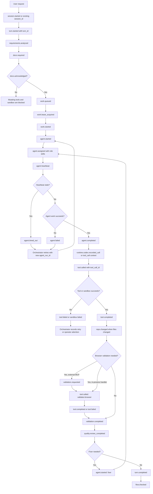
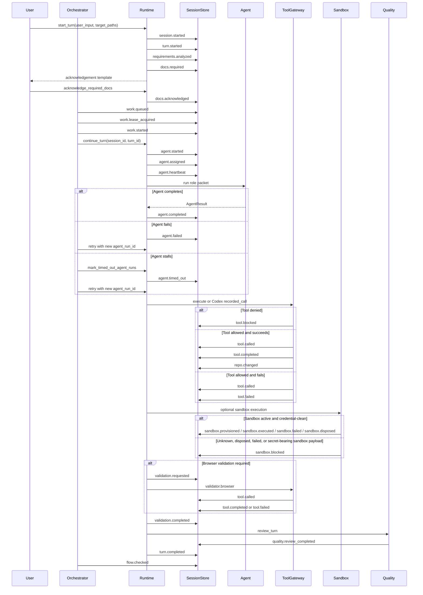

# Harness Execution Flow

This document is the working contract for the harness. New runtime,
orchestration, tool, sandbox, or validation work should preserve this flow.
When the implementation changes, update this document and the flow checks
together.

## Practical Summary

The main `session_id` is the durable ledger. A `turn_id` is one user request
inside that ledger. Agent runs, tool calls, and sandboxes are replaceable
workers attached to the ledger.

If an agent, tool, or sandbox fails, the session should not be treated as lost.
The failure is recorded as an event, and the orchestrator can retry the pending
work with a new `agent_run_id`, `tool_call_id`, or `sandbox_ref`.

## Execution Contract

1. Start or resume the durable `session_id`.
2. Emit `turn.started` for one user request.
3. Emit `requirements.analyzed` before planning, writing, shell, sandbox, or
   unknown tool execution.
4. Emit `docs.required` with the policy-selected documents.
5. Block mutating tools and sandbox work until `docs.acknowledged` exists for
   the current turn.
6. Start role work with `agent.started`, `agent.assigned`, and
   `agent.heartbeat`.
7. Complete, fail, or time out each role with one of `agent.completed`,
   `agent.failed`, or `agent.timed_out`.
8. Wrap Codex-facing host tools with `runtime.codex.recorded_call(...)` or
   `runtime.codex.tool_call(...)`.
9. Record every tool as `tool.called`, then `tool.completed` or `tool.failed`
   with the same `tool_call_id`.
   A turn must not close while a `tool.called` event is still missing its
   terminal event.
10. Denied tools record `tool.blocked` and do not emit `tool.called`.
11. Record sandbox work through `sandbox.provisioned`, `sandbox.executed`,
    `sandbox.failed`, `sandbox.disposed`, and `sandbox.blocked` using
    `sandbox_ref`.
12. Do not provision or execute a sandbox before required-document
    acknowledgement when required documents exist.
13. Do not pass credentials, tokens, passwords, or secret-looking payload keys
    into sandbox resources or sandbox execution input.
14. Record changed files as `repo.changed` with the responsible
    `tool_call_id`. A changed-file event without `tool_call_id` is treated as
    an unwrapped host-tool change.
15. Record reviewer validation as `validation.completed`. When validation calls
    an external browser tool, route it through `validator.browser` so
    `tool.called`, `tool.completed`, or `tool.failed` share the same
    `tool_call_id`.
    If the Playwright MCP run happens outside the Python runtime, emit
    `validation.requested` first and later record the MCP result through the
    `validator.browser` bridge.
16. Record quality review as `quality.review_completed`.
17. Route immediate repair through `fixer` when quality review requests it.
18. Finish the turn with `turn.completed`, or leave it open for retry or
    operator attention.
19. Orchestrated work should claim a queued item with `work.lease_acquired`
    before emitting `work.started`.
20. Run `flow.checked` after orchestrated execution to confirm the event stream
    still follows this contract.

## Main Flow

## Sequence Flow

## Flow Check Rules

The harness should continuously check these rules while new features are
developed:

- `requirements.analyzed` must exist before `docs.required`.
- Gated `tool.called` events must have both `requirements.analyzed` and
  `docs.acknowledged` earlier in the same turn.
- Every `agent.completed`, `agent.failed`, or `agent.timed_out` must match an
  earlier `agent.started`.
- Every `tool.completed` or `tool.failed` must match an earlier `tool.called`
  by `tool_call_id`.
- Every `tool.called` before `turn.completed` must have `tool.completed` or
  `tool.failed` before `turn.completed`.
- Every `repo.changed` with a `tool_call_id` must match an earlier
  `tool.called`.
- Every `repo.changed` must include the responsible `tool_call_id`.
- Every `validation.completed` with a `tool_call_id` must match an earlier
  `tool.called`.
- Every `sandbox.executed`, `sandbox.failed`, or `sandbox.disposed` must match
  an earlier `sandbox.provisioned` by `sandbox_ref`.
- `sandbox.executed` must not appear after the same `sandbox_ref` was already
  `sandbox.disposed` or `sandbox.failed`.
- `sandbox.provisioned` must appear after `requirements.analyzed`, and after
  `docs.acknowledged` when the turn has required documents.
- `turn.completed` must not appear before `quality.review_completed`.
- Every `work.lease_acquired` must match an earlier `work.queued` by
  `work_item_id`.
- Every `work.started` must match both an earlier `work.queued` and an earlier
  `work.lease_acquired` by `work_item_id`.
- Every `work.retry_scheduled` must reference an earlier queued item through
  `retry_of`.
- Orchestrated runs should emit `flow.checked` after execution.

## Development Rule

Before adding new runtime behavior, identify which event in this document it
produces or consumes. If the behavior needs a new event, add it here, update
the flow checker, and add a test that proves the event stream still follows
the contract.
