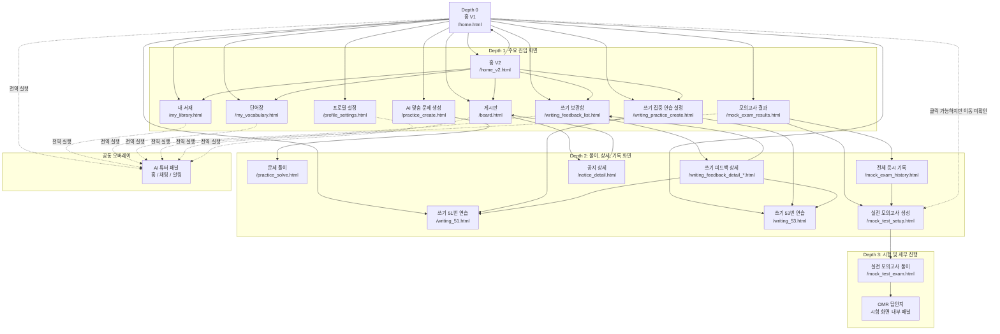
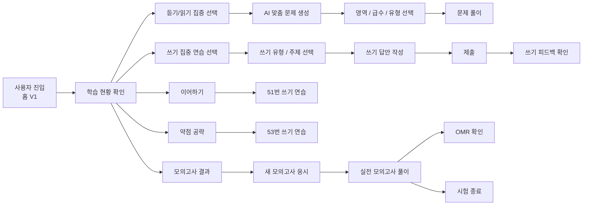
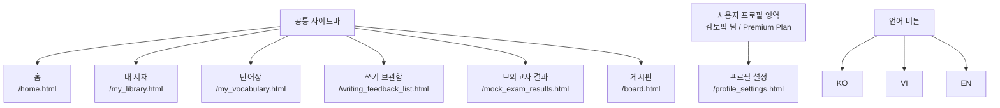
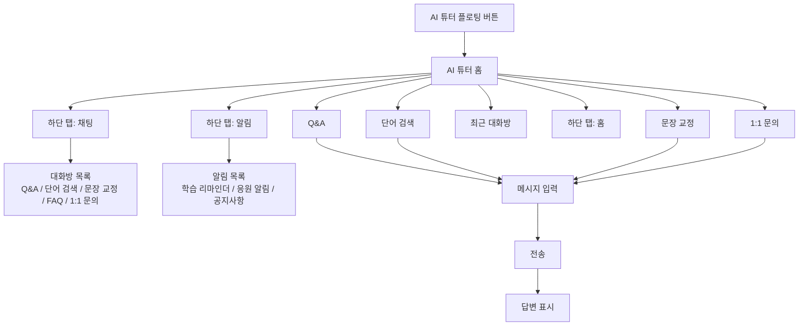
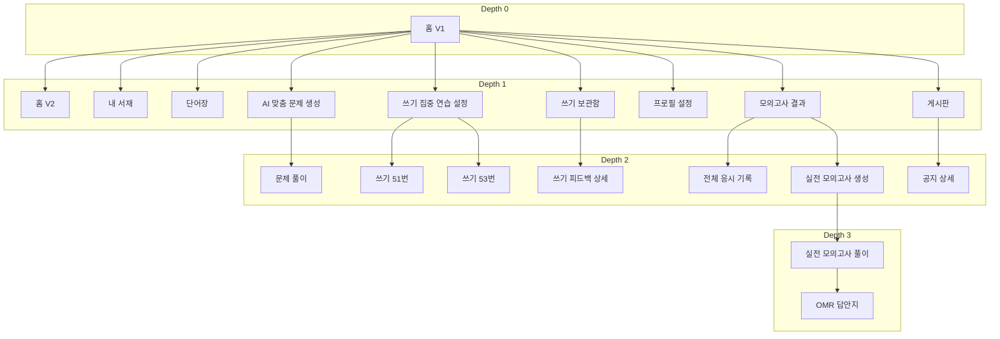

# TALKPIK AI 사이트맵 및 페이지 연결도

> Status note (2026-04-24)
>
> The Mermaid map below documents the observed route names from a legacy HTML
> deployment. Keep it as product-history context.
>
> For current implementation work, use the React route map below first, then
> confirm against `src/App.tsx`.

확인 기준: 2026-04-22에 배포 사이트를 Playwright MCP로 직접 탐색한 화면과 클릭 결과입니다.

이 문서는 사이트맵, 페이지 뎁스, 주요 연결 상태를 Mermaid 코드로 볼 수 있게 정리한 문서입니다. Mermaid는 문서 안에서 화면 구조를 다이어그램으로 표현하는 문법입니다.

## Current React Route Map

| Legacy observed URL | Current React route | Notes |
| --- | --- | --- |
| `/home.html` | `/` | Home V1 |
| `/home_v2.html` | `/home-v2` | Home V2 |
| `/practice_create.html` | `/practice/create` | Practice generation |
| `/practice_solve.html` | `/practice/solve` | Practice solve |
| `/writing_practice_create.html` | `/writing/setup` | Writing setup |
| `/writing_51.html` | `/writing/51` | Writing task 51 |
| `/writing_53.html` | `/writing/53` | Writing task 53 |
| `/my_library.html` | `/library` | Library |
| `/my_vocabulary.html` | `/vocabulary` | Vocabulary |
| `/writing_feedback_list.html` | `/writing/feedback` | Feedback list |
| `/writing_feedback_detail_*.html` | `/writing/feedback/:id` | Dynamic feedback detail |
| `/mock_exam_results.html` | `/mock/results` | Mock results / overview |
| `/mock_test_exam.html` | `/mock/exam` | Live mock exam |
| `/board.html` | `/board` | Board |
| `/profile_settings.html` | `/profile` | Profile settings |
| `/mock_exam_history.html` | no dedicated route | Legacy-only page note |
| `/mock_test_setup.html` | no dedicated route | Legacy-only page note |
| `/notice_detail.html` | no dedicated route | Legacy-only page note |

## 뎁스 기준

- Depth 0: 사용자가 처음 들어오는 홈
- Depth 1: 사이드바나 홈에서 바로 갈 수 있는 주요 화면
- Depth 2: 주요 화면에서 한 번 더 들어가는 설정, 목록, 상세, 풀이 화면
- Depth 3: 풀이나 상세 화면 안에서 이어지는 세부 행동 화면
- 공통 오버레이: 특정 페이지에 속하지 않고 여러 화면 위에 뜨는 AI 튜터

## 사이트맵

## 주요 사용자 흐름 연결도

## 공통 내비게이션 연결도

## AI 튜터 연결도

## 깊이별 페이지 목록

## 표시 규칙

- 실선 화살표: 직접 확인된 이동 또는 화면 연결입니다.
- 점선 화살표: 전역 패널처럼 여러 화면에서 뜨는 연결이거나, 클릭 가능하지만 이동이 명확하지 않은 연결입니다.
- `*`가 들어간 URL은 같은 구조의 상세 페이지가 여러 개 있다는 뜻입니다.
